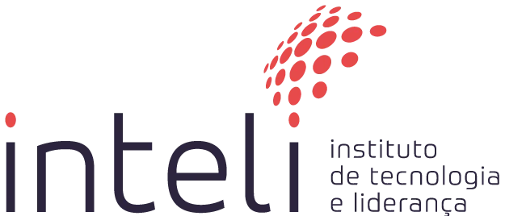

# Inteli - Instituto de Tecnologia e Liderança 

<p align="center">
<a href= "https://www.inteli.edu.br/"></a>
</p>

<br>

# AMNES.IA

---

### 01 STUDIOS

---

## 👨‍🎓 Integrantes: 
- <a href="https://www.linkedin.com/in/ana-camily-1125a83b1/">Ana Camily Figueiredo dos Santos</a>
- <a href="https://www.linkedin.com/in/breno-gallego-martins/">Breno Gallego Martins</a>
- <a href="https://www.linkedin.com/in/gabriel-lorenzo-baglioli-de-loyola/">Gabriel Lorenzo Baglioli de Loyola</a> 
- <a href="https://www.linkedin.com/in/guilherme-b-souza-9b63b63b7/">Guilherme Barbosa de Souza</a> 
- <a href="https://www.linkedin.com/in/lucas-lopes-8072b235a/">Lucas Garcia Rodrigues Lopes</a>
- <a href="https://www.linkedin.com/in/miguel-rodrigues-1b72863b0/">Miguel Augusto Evelin Freire Rodrigues</a> 
- <a href="https://www.linkedin.com/in/raffael-bensoussan-98331b187/">Raffael Cabral Bensoussan</a>
- <a href="https://www.linkedin.com/in/raphaela-rodrigues-luvizotto/">Raphaela Rodrigues Luvizotto</a>

## 👩‍🏫 Professores:
### Orientador(a) 
- <a href="https://www.linkedin.com/in/juliastateri/">Julia Stateri</a>
### Instrutores
- <a href="https://www.linkedin.com/in/filipe-gon%C3%A7alves-08a55015b/">Filipe Gonçalves de Souza Nogueira da Silva</a> 
- <a href="https://www.linkedin.com/in/heloisacandello/">Heloisa Caroline de Souza Pereira Candello</a> 
- <a href="https://www.linkedin.com/in/erinaldofonseca/">Jose Erinaldo da Fonseca</a>
- <a href="https://www.linkedin.com/in/luciano-galdino-26191b36/">Luciano Galdino</a>
- <a href="https://www.linkedin.com/in/natalia-k-37a62052/">Natalia Varela da Rocha Kloeckner</a> 

## 📜 Descrição

AMNES.IA é um jogo educacional digital desenvolvido por estudantes do Inteli em parceria com o IBM SkillsBuild, com o objetivo de tornar o aprendizado introdutório de Inteligência Artificial mais engajante e acessível para universitários.

A narrativa gira em torno de um estudante do primeiro ano que, na véspera de um seminário sobre IA, estuda intensamente até o limite da exaustão. Na manhã seguinte, ele acorda com uma amnésia temporária causada pelo estresse extremo e não consegue lembrar de nada do que estudou. Com a ajuda do seu computador e dos materiais da IBM, o jogador precisa ajudá-lo a recuperar os fragmentos perdidos de memória, reconstruindo gradualmente seu conhecimento antes da apresentação.

O jogo é singleplayer, roda diretamente no navegador (sem instalação) e foi projetado para desktops e notebooks, utilizando teclado e mouse. Ao longo da jornada, o jogador avança por fases compostas por minigames variados, cada um explorando um conceito diferente de IA, como machine learning, redes neurais e IA generativa, de forma prática e interativa.

Entre os minigames, destaca-se o puzzle da primeira fase, inspirado no jogo Power Flow, onde o jogador organiza cards com conceitos de IA para completar um circuito e ligar o computador. Outras fases incluem desafios com uma garra mecânica coletando itens, um minigame de conexão com cabos e fios, e um confronto com um "boss" na fase final. Entre cada fase, o jogador retorna ao quarto do personagem, podendo revisar um quadro de memórias com os conceitos aprendidos.

A proposta central do projeto é substituir o aprendizado passivo, baseado em leitura e vídeo, por uma experiência ativa, com feedback imediato, progressão por fases e recompensas que incentivam a continuidade. O jogo se posiciona no mercado de EdTech, setor avaliado em mais de US$163 bilhões globalmente, e se diferencia por unir a credibilidade do IBM SkillsBuild à imersão e dinamismo da gamificação.

A solução foi pensada para um público de jovens universitários, predominantemente entre 18 e 25 anos, que buscam formas mais modernas e eficientes de aprender tecnologia e que frequentemente abandonam cursos online tradicionais pela falta de engajamento. Ao transformar conceitos abstratos de IA em desafios jogáveis, o AMNES.IA torna o aprendizado mais significativo, motivador e alinhado com a realidade do estudante contemporâneo.

Link do jogo: https://graduacao.pages.git.inteli.edu.br/2026-1a/t29/g01 

## 📁 Estrutura de pastas

Dentre os arquivos e pastas presentes na raiz do projeto, definem-se:

```bash
g01/
│
├── documents/              # Documentação do projeto
│   ├── assets/             # Imagens e recursos da documentação
│   ├── other/              # Arquivos complementares
│   └── gdd.md              # Game Design Document
│
├── public/                 # Arquivos públicos do jogo
│   ├── assets/             # Recursos do jogo (imagens, sprites, etc.)
│   ├── src/                # Código-fonte principal (cenas e lógica)
│   └── auxiliares/         # Arquivos que auxiliam em algumas configurações
│
├── index.html              # Arquivo principal do jogo
├── .gitlab-ci.yml          # Configuração de CI/CD do GitLab
├── README.md               # Documentação principal do projeto

```

## 🔧 Como executar o código

## 📌 Pré-requisitos

Antes de executar o projeto, certifique-se de que sua máquina possui os seguintes requisitos:

- Navegador atualizado (Google Chrome, Microsoft Edge ou Firefox)
- Editor de código (recomendado: Visual Studio Code)
- Git instalado
- Node.js (versão 18 ou superior)
- npm (já incluso com o Node.js)
- Extensão Live Server no VS Code (opcional, mas recomendada)

---

## ⚙️ Instalação do Projeto

Siga o passo a passo abaixo para baixar e executar o jogo em sua máquina:

### 1. Clonar o repositório
```bash
git clone https://git.inteli.edu.br/graduacao/2026-1a/t29/g01.git
```

### 2. Acessar a pasta do projeto
```bash
cd g01
```

### 3. Instalar as dependências
```bash
npm install
```

Este comando instala todas as bibliotecas necessárias para o funcionamento do projeto (caso existam dependências configuradas).

---

## ▶️ Execução do Projeto

Você pode rodar o projeto de duas formas:

### 🔹 Opção 1: Live Server (Recomendado)

1. Abra o projeto no Visual Studio Code
2. Clique com o botão direito no arquivo `index.html`
3. Selecione **"Open with Live Server"**

O jogo será aberto automaticamente no navegador.

### 🔹 Opção 2: Via Node.js

Caso o projeto possua scripts configurados:
```bash
npm start
```

---

## 🌐 Acesso ao Jogo

Após iniciar o servidor, acesse no navegador:
*(ou a porta indicada no terminal)*

---

## ⚠️ Possíveis Problemas e Soluções

- **Erro ao clonar o repositório**
  → Verifique se você possui acesso ao GitLab do Inteli
  → Faça login no GitLab institucional

- **Erro de certificado (SEC_E_UNTRUSTED_ROOT)**
  → Pode ser necessário configurar o Git para confiar no certificado da instituição

- **Imagens ou arquivos não carregam**
  → Verifique se os caminhos dos arquivos estão corretos no código

- **Projeto não abre corretamente**
  → Certifique-se de usar um navegador atualizado

---

## 👨‍💻 Tecnologias Utilizadas

Este projeto foi desenvolvido utilizando:

- JavaScript (ES6+)
- HTML5
- CSS3
- Phaser.js (framework de jogos 2D)

---

## ✅ Observações Finais

- Certifique-se de manter a estrutura de pastas original do projeto
- Recomenda-se o uso do Live Server para evitar problemas com carregamento de arquivos locais
- O projeto foi desenvolvido para fins educacionais

---

## 🗃 Histórico de lançamentos

* 0.1.0 - 13/02/2026
    * Implementação inicial do jogo com cenário de quarto, movimentação do personagem e estrutura básica responsiva.
* 0.2.0 - 27/02/2026
    * Organização do projeto em cenas e desenvolvimento dos primeiros minigames, incluindo introdução, interação e progressão entre fases.
* 0.3.0 - 13/03/2026
    * Adição da seleção de personagens, animações, integração entre cenas e implementação completa da segunda fase.
* 0.4.0 - 27/03/2026
    * Finalização do MVP com múltiplas fases, mecânicas variadas, narrativa integrada e sistema de progressão educativa.
* 0.5.0 - 10/04/2026
    * Finalização do jogo com base nas indicações de melhorias do playtest.

## 📋 Licença/License

<p xmlns:cc="http://creativecommons.org/ns#" xmlns:dct="http://purl.org/dc/terms/"><a property="dct:title" rel="cc:attributionURL" href="https://www.inteli.edu.br/">Inteli</a> by <a href="https://www.linkedin.com/in/ana-camily-1125a83b1/">Ana Camily Figueiredo dos Santos</a>, <a href="https://www.linkedin.com/in/breno-gallego-martins/">Breno Gallego Martins</a> , <a href="https://www.linkedin.com/in/gabriel-lorenzo-baglioli-de-loyola/">Gabriel Lorenzo Baglioli de Loyola</a>, <a href="https://www.linkedin.com/in/guilherme-b-souza-9b63b63b7/">Guilherme Barbosa de Souza</a>, <a href="https://www.linkedin.com/in/lucas-lopes-8072b235a/">Lucas Garcia Rodrigues Lopes</a>, <a href="https://www.linkedin.com/in/miguel-rodrigues-1b72863b0/">Miguel Augusto Evelin Freire Rodrigues</a>, <a href="https://www.linkedin.com/in/raffael-bensoussan-98331b187/">Raffael Cabral Bensoussan</a>, <a href="https://www.linkedin.com/in/raphaela-rodrigues-luvizotto/">Raphaela Rodrigues Luvizotto</a>
</a> is licensed under <a href="http://creativecommons.org/licenses/by/4.0/?ref=chooser-v1" target="_blank" rel="license noopener noreferrer" style="display:inline-block;">Attribution 4.0 International</a>.</p>


