# AMNES.IA - Game Design Document (GDD) - Módulo 1 - Inteli

---

## 01 STUDIOS

---

#### Nomes dos integrantes do grupo

- <a href="https://www.linkedin.com/in/ana-camily-1125a83b1/?utm_source=share_via&utm_content=profile&utm_medium=member_ios">Ana Camily</a>
- <a href="https://www.linkedin.com/in/breno-gallego-martins/">Breno Martins</a>
- <a href="https://www.linkedin.com/in/gabriel-lorenzo-baglioli-de-loyola/">Gabriel Lorenzo</a>
- <a href="https://www.linkedin.com/in/guilherme-b-souza-9b63b63b7/">Guilherme Souza</a>
- <a href="https://www.linkedin.com/in/lucas-lopes-8072b235a/">Lucas Lopes</a>
- <a href="https://www.linkedin.com/in/miguel-rodrigues-1b72863b0/">Miguel Augusto</a>
- <a href="https://www.linkedin.com/in/raffael-bensoussan-98331b187/?skipRedirect=true">Raffael Bensoussan</a>
- <a href="https://www.linkedin.com/in/raphaela-rodrigues-luvizotto/">Raphaela Luvizotto</a>


## Sumário

[1. Introdução](#c1)

[2. Visão Geral do Jogo](#c2)

[3. Game Design](#c3)

[4. Desenvolvimento do jogo](#c4)

[5. Casos de Teste](#c5)

[6. Conclusões e trabalhos futuros](#c6)

[7. Referências](#c7)

[Anexos](#c8)

<br>


# <a name="c1"></a>1. Introdução 

## 1.1. Plano Estratégico do Projeto

### 1.1.1. Contexto da indústria 

O projeto insere-se no mercado global de EdTech, que integra educação online, jogos educacionais (serious games) e formação em inteligência artificial. Relatórios de mercado indicam que o setor foi avaliado em cerca de US$163 bilhões em 2024, com projeção de alcançar aproximadamente US$348 bilhões até 2030 (Grand View Research, 2024), impulsionado pela digitalização do ensino e pela crescente demanda por requalificação profissional em tecnologia. Nesse ecossistema destacam-se plataformas como Coursera, Udemy e edX. Tendências como gamificação, microlearning, aprendizagem imersiva e uso de IA vêm transformando a experiência educacional. Nesse contexto, a IBM SkillsBuild diferencia-se ao oferecer capacitação gratuita em tecnologia e inteligência artificial, associando desenvolvimento de habilidades digitais a iniciativas de inclusão digital e impacto social.

#### 1.1.1.1. Modelo de 5 Forças de Porter 

**Ameaça de Novos Entrantes**

A criação de um jogo para melhor aproveitamento de uma plataforma educacional é permeada de múltiplos fatores desafiadores. As etapa de criação devem se comunicar e passar uma mensagem que faça sentido a cada jogada e minuto gasto, necessitando assim de pessoas responsáveis para cada área de desenvolvimento: história, design, jogabilidade e programação. É de extrema importância que o conteúdo apresentado tenha validade técnica e seja de acordo com a missão, visão e propósito da empresa parceira, que por sua vez, atuará como agente moderador em todas as etapas de criação.

O aumento de empresas entrantes traria para a prática da gameficação uma visibilidade positiva e inovadora para plataformas de ensino. As tecnologias necessárias no processo de criação (ferramentas de design, frameworks de desenvimento etc.) seriam amplamente desenvolvidas, aprimorando a experiência de aprendizagem do usuário. Dessa forma, a ameaça de novos entrantes pode ser considerada média, pois, embora existam barreiras técnicas e organizacionais, o avanço das tecnologias e o crescimento do setor de EdTech facilitam a entrada de novos concorrentes.

**Ameaça de Substitutos**
No contexto de educação em Inteligência Artificial, a ameaça de substituto é muito alta. Existem inúmeras formas de aprenzado: IA's Generativas, Livros, Videoaulas, materiais web etc. Essas alternativas são opções mais utilizadas quanto ao uso destinado a obtenção de informação, mesmo que haja menor confiabilidade e segurança de informação. 

**Poder de Barganha dos Fornecedores**

Os fornecedores se diversificam em função da quantidade das áreas de criação do projeto: Design, Progamação, Especialistas da área em questão.

A linguagem de programação utilizada na criação dos jogos já é amplamente estudada e aplicada nessa área, sendo portanto de acesso gratuíto as plataformas necessárias para execução dos códigos.

Quanto ao design, existem plataformas web que vendem pacotes de assets com direitos autorais liberados e também que possibiitam a criação de elementos gráficos (Itch.io é um deles, por exemplo). É necessário criar uma identidade visual que se adeque as polítias de LGPD da empresa e do conteúdo a ser aprendido. Por serem áreas com mercado bastante amplo, o poder de barganha dos fornecedores tende a ser moderado/baixo, com exceção dos profissinais específicos de cada área, que por ofertarem serviços altamente direcionados, possuem um poder de barganha mediana/alta.


**Poder de Barganha dos Clientes**

Para este projeto, os clientes principais são os estudantes universitários e usuários em potencial do IBM Skills Build. O poder de barganha desse público é considerado alto , pois eles possuem um leque vasto de opções para aprender sobre Inteligência Artificial no mercado atual. O custo e a dificuldade para trocar de plataforma são praticamente nulos; se uma metodologia não agradar, basta um clique para acessar outro site ou aplicativo.

Além disso, por ser um público majoritariamente sensível a preços  (frequentemente buscando soluções gratuitas ou de baixo custo) e com tempo limitado, eles exigem uma qualidade alta e resultados rápidos. Se o jogo digital não for altamente engajador, imersivo e não demonstrar valor prático imediato, o cliente facilmente abandonará a iniciativa da IBM para consumir o conteúdo em plataformas concorrentes ou métodos substitutos.

Dessa forma, considerando a variedade de alternativas disponíveis e a facilidade de troca entre plataformas, conclui-se que o poder de barganha dos clientes é alto.

**Rivalidade entre Concorrentes**

A rivalidade no mercado de EdTechs focadas no ensino gamificado e em Inteligência Artificial é considerada alta e extremamente competitiva. O IBM Skills Build concorre diretamente pela atenção dos alunos com gigantes do aprendizado online (como Coursera, Udemy e edX), plataformas nativamente gamificadas (como Kahoot! e Duolingo) e iniciativas educacionais de outras Big Techs (como Microsoft Learn e Google Cloud Skills Boost).

Nesse cenário, existe uma forte "guerra de preços", uma vez que a maioria desses concorrentes oferece trilhas de introdução à IA de forma totalmente gratuita ou por assinaturas de baixo custo. Por isso, a diferenciação (como uma gamificação altamente imersiva e certificações de peso) é o único caminho para gerar adesão. Para ilustrar o aquecimento desse setor, dados de mercado apontam que o setor global de gamificação na educação deve crescer a uma taxa anual composta (CAGR) de mais de 26% até 2035 (Industry Research, 2026), o que atrai massivos investimentos e um número cada vez maior de novas empresas disputando o mesmo público.

### 1.1.2. Análise SWOT 

A análise do projeto evidencia fatores internos e externos que influenciam seu desenvolvimento. Entre as forças, destaca-se a associação ao IBM SkillsBuild, cuja relação com a IBM e com certificações em competências digitais e inteligência artificial fortalece a credibilidade do jogo e aproxima a experiência lúdica de conteúdos valorizados no mercado de trabalho. Além disso, a organização do aprendizado em fases gamificadas com desafios sobre conceitos de IA estimula o engajamento e a progressão dos jogadores, enquanto o acesso gratuito amplia a inclusão digital. Entre as fraquezas estão a dependência de dispositivos e conexão à internet, além da necessidade constante de atualização dos desafios e conteúdos de IA presentes nas fases do jogo. Já as oportunidades envolvem o crescimento da EdTech e da formação introdutória em IA, enquanto as ameaças incluem a concorrência de plataformas educacionais online, a saturação de cursos digitais e exigências da LGPD.

Figura 1: Análise Swot

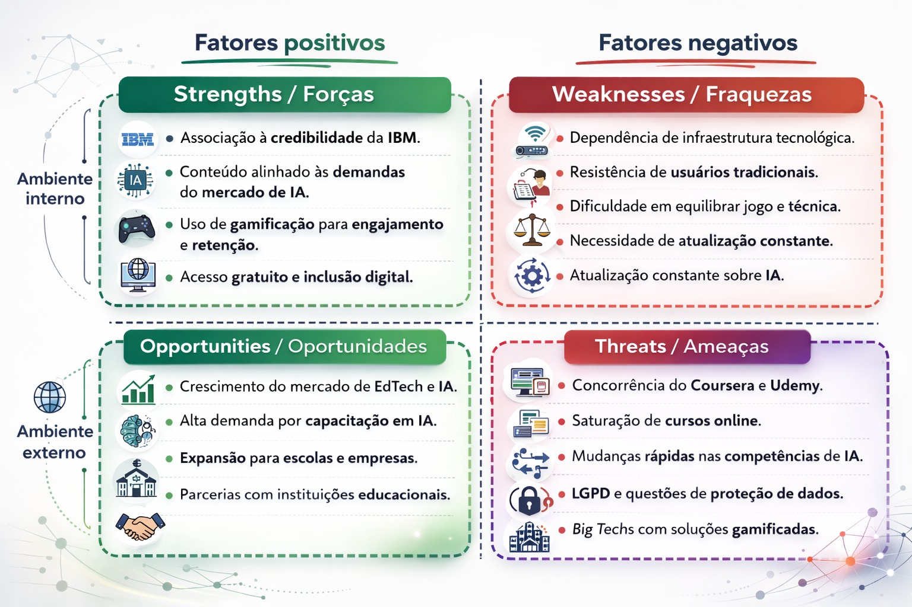

Fonte: AmnesIA, Inteli, 2025.

### 1.1.3. Missão / Visão / Valores 

Missão:
Facilitar o aprendizado introdutório de Inteligência Artificial por meio de uma experiência narrativa e gamificada, para universitários.  

Visão:
Tornar-se um modelo de excelência em ensino gamificado de Inteligência Artificial para universitários na América Latina.

Valores:
Uso ético e responsável da Inteligência Artificial / promoção da aprendizagem ativa / inclusão digital e democratização do acesso ao conhecimento / inovação educacional e desenvolvimento tecnológico.

### 1.1.4. Proposta de Valor 

Figura 2: Canvas Proposta de valor

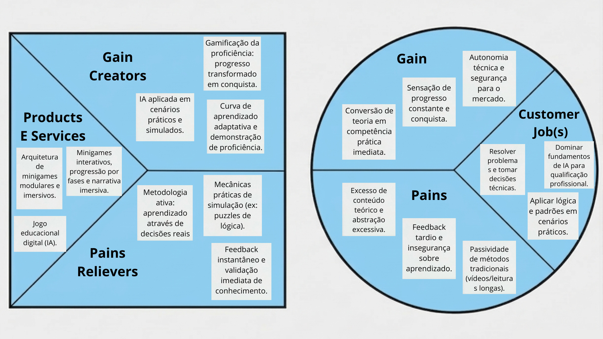

Fonte: AmnesIA, Inteli, 2025.

**Customer Job(s)**

O jogador precisa aprender os conceitos fundamentais de Inteligência Artificial, como machine learning, redes neurais e IA generativa, para compreender os desafios propostos no jogo. Nesse contexto, o aprendizado ocorre de forma prática, por meio de minigames e atividades interativas que exigem a aplicação de lógica, reconhecimento de padrões e tomada de decisão. Dessa forma, o jogador desenvolve habilidades como raciocínio lógico, autonomia e capacidade de resolver problemas, preparando-se para aplicar esses conhecimentos em projetos e no mercado de trabalho. Além disso, esse processo contribui para uma aprendizagem mais significativa e conectada com situações reais.

**Gain**

O uso de um jogo como ferramenta de ensino proporciona um aprendizado mais interativo e dinâmico, substituindo métodos tradicionais baseados apenas em leitura ou vídeo por experiências práticas e envolventes. Por meio de minigames, desafios e progressão por fases, o usuário participa ativamente do processo, o que aumenta o engajamento, a motivação e a qualidade da experiência educacional. Além disso, a abordagem interativa facilita a compreensão de conceitos complexos de Inteligência Artificial, ao transformar conteúdos abstratos em experiências visuais e práticas, promovendo maior retenção do conteúdo. Por fim, o sistema de progressão estimula a sensação de conquista e evolução, incentivando a continuidade dos estudos e contribuindo para o desenvolvimento de habilidades como raciocínio lógico, resolução de problemas e autonomia. Com isso, o aprendizado se torna mais eficiente e alinhado às necessidades do usuário contemporâneo.

**Pains**

Observa-se uma falta de motivação na continuidade dos cursos, especialmente quando o aprendizado é baseado em métodos teóricos, repetitivos e pouco interativos, o que contribui para altos índices de evasão. Além disso, muitos usuários enfrentam dificuldades na compreensão de conteúdos complexos de Inteligência Artificial, devido ao excesso de teoria e à ausência de aplicação prática, o que torna o aprendizado mais cansativo e menos eficiente. Além disso, é identificado um baixo engajamento em cursos online, principalmente em formatos assíncronos, nos quais o usuário assume um papel passivo, reduzindo sua participação e interesse. A falta de interatividade, desafios e feedback imediato torna a experiência pouco envolvente, aumentando as chances de abandono ao longo do processo de aprendizagem. Esse cenário evidencia a necessidade de abordagens mais ativas e centradas no usuário.

**Products e Services**

Trata-se de um jogo educacional digital voltado ao ensino de Inteligência Artificial, inspirado nos conteúdos do IBM SkillsBuild, que busca transformar o aprendizado tradicional em uma experiência mais envolvente. A proposta utiliza minigames interativos, progressão por fases e uma narrativa imersiva para integrar teoria e prática dentro do próprio ambiente do jogo. Em vez de apenas estudar conceitos, o usuário os aplica diretamente em desafios, o que facilita a compreensão e torna o processo mais dinâmico. Dessa forma, o jogo promove um aprendizado mais ativo, estimulando o raciocínio lógico, o engajamento contínuo e a construção prática do conhecimento em IA. Além disso, a solução se adapta ao ritmo do usuário, permitindo uma experiência personalizada de aprendizagem.

**Gain Creators**

A narrativa imersiva e a progressão por fases funcionam como importantes geradores de valor ao aumentar o engajamento do usuário, transformando o aprendizado em uma jornada envolvente. Ao acompanhar sua evolução dentro do jogo, o jogador desenvolve um senso de progresso e objetivo, o que estimula a curiosidade e a continuidade no aprendizado. Além disso, a utilização de elementos de gamificação, como desafios, recompensas e metas, torna a experiência mais dinâmica e atrativa, incentivando a participação ativa e o desenvolvimento do raciocínio lógico e da tomada de decisão. Por fim, os minigames e desafios práticos permitem a aplicação direta dos conceitos de Inteligência Artificial, facilitando a compreensão e aumentando a retenção do conteúdo, uma vez que o aprendizado ocorre por meio da experiência. Dessa maneira, o jogo cria um ambiente propício para o aprendizado contínuo e motivador.

**Pains Relievers**

O modelo tradicional de aprendizado passivo é substituído por uma experiência interativa, na qual o usuário participa ativamente por meio de desafios e da tomada de decisões, aumentando o engajamento e reduzindo o desinteresse. Além disso, os conteúdos teóricos são transformados em desafios práticos dentro do jogo, o que facilita a compreensão e torna o aprendizado mais acessível, especialmente em temas complexos de Inteligência Artificial. Por fim, a oferta de feedback imediato aliada à progressão por fases estruturadas permite que o usuário acompanhe seu desempenho, reduzindo frustrações e incentivando a continuidade dos estudos de forma mais motivadora e eficiente. Assim, a solução atua diretamente na superação das principais dificuldades identificadas no processo de aprendizagem.


### 1.1.5. Descrição da Solução Desenvolvida 

A solução desenvolvida busca resolver o problema de baixo engajamento nas plataformas tradicionais de ensino, principalmente quando se trata de aprender Inteligência Artificial. Muitas vezes o conteúdo é muito teórico ou pouco interativo, o que faz com que os usuários percam o interesse ao longo do tempo. Pensando nisso, o projeto propõe um jogo educacional (Amnes.ia) dentro do contexto do IBM SkillsBuild, usando gamificação para deixar o aprendizado mais dinâmico, leve e envolvente.

Para trazer mais valor, o jogo conta com sistema de progressão, desafios e recompensas que incentivam o usuário a continuar jogando e aprendendo. Além disso, os conteúdos são apresentados de forma mais prática, dentro da própria experiência do jogo, facilitando o entendimento. Com isso, a solução ajuda a tornar o aprendizado mais interessante e eficiente, unindo educação e entretenimento de um jeito mais moderno e próximo do que o usuário espera.

### 1.1.6. Matriz de Riscos 
A Matriz de Riscos, também conhecida como Matriz de Probabilidade e Impacto, é uma ferramenta visual amplamente utilizada na gestão de riscos com o objetivo de priorizar os riscos identificados em um projeto. Ela apoia a tomada de decisões e a definição de medidas preventivas, além de promover o engajamento da equipe no processo de identificação, análise e controle dos riscos envolvidos.
Sua estrutura é baseada em duas dimensões principais. A primeira é a probabilidade, que mede a chance de um risco ocorrer e costuma ser classificada em níveis como muito baixo, baixo, moderado, alto e muito alto, podendo também ser expressa em porcentagens. A segunda é o impacto, que representa as consequências caso o risco se concretize, seguindo a mesma escala de classificação (PROJECT MANAGEMENT INSTITUTE, 2017).
A combinação entre essas duas dimensões resulta na classificação geral do risco, normalmente representada por cores na matriz, o que permite identificar rapidamente o nível de criticidade de cada item, entre alto, médio e baixo. Essa visualização facilita o foco da equipe nos riscos mais relevantes e orienta a construção de um plano de ações eficaz.
Para cada risco identificado, é elaborado um plano de ação com medidas estratégicas voltadas a prevenir, minimizar ou responder à sua ocorrência, reduzindo os possíveis impactos no projeto. Esse planejamento orienta as decisões da equipe e contribui para uma gestão mais eficiente e proativa.
No contexto do nosso projeto, a matriz de riscos foi utilizada para avaliar os riscos identificados ao longo do desenvolvimento do jogo AMNES.IA, considerando tanto aspectos internos, como desafios técnicos e pedagógicos da equipe, quanto aqueles relacionados à entrega do produto e ao alinhamento com o parceiro IBM SkillsBuild.

Figura 3: Ameaças – Matriz de Risco

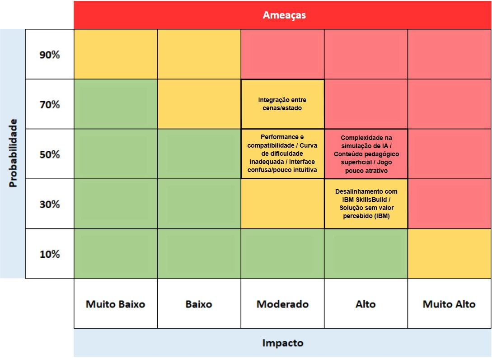

Fonte: AmnesIA, Inteli, 2025.

**Descrição:**


**1. Complexidade na simulação de conceitos de IA.**

Trata-se de um risco de natureza tecnológica. Sua probabilidade de ocorrência foi estimada em 50%, pois embora a equipe tenha clareza sobre os conceitos a serem abordados, a tradução desses conteúdos em mecânicas jogáveis é um desafio técnico real que pode surgir a qualquer momento do desenvolvimento. O impacto foi classificado como alto porque, caso esse risco se concretize, o jogo pode falhar em seu principal objetivo, ensinar IA de forma acessível, comprometendo diretamente a proposta de valor junto à IBM SkillsBuild. A combinação desses dois fatores resulta em uma classificação geral alta, tornando este um dos riscos prioritários do projeto. Os minigames precisam representar conceitos de Inteligência Artificial de forma simplificada e pedagogicamente correta, o que pode gerar dificuldades técnicas ao equilibrar fidelidade conceitual com jogabilidade acessível. Como plano de ação, a equipe deve revisar o conteúdo com especialistas em IA antes da implementação de cada fase, realizar testes iterativos com usuários durante os sprints e adotar simplificação progressiva dos conceitos ao longo das fases do jogo.

**2. Problemas de performance e compatibilidade entre navegadores.**

Trata-se de um risco de natureza tecnológica. Sua probabilidade foi estimada em 50%, pois o uso de diferentes dispositivos e navegadores pelos usuários é uma realidade comum, mas a equipe já adota boas práticas de desenvolvimento web que reduzem parcialmente essa chance. O impacto foi classificado como médio porque, embora problemas de compatibilidade possam prejudicar a experiência de alguns usuários, eles não inviabilizam o funcionamento geral do jogo e tendem a ser corrigidos com ajustes pontuais. Essa combinação resulta em uma classificação geral média. O jogo é desenvolvido em Phaser 3 e executado via navegador web, e diferentes dispositivos, resoluções e navegadores podem comprometer a experiência, especialmente em máquinas com menor desempenho. Como plano de  ação, a equipe deve realizar testes em múltiplos navegadores e tamanhos de tela, otimizar assets por meio da compressão de imagens e spritesheets e definir e documentar a resolução mínima suportada pelo jogo.

**3. Falhas na integração entre cenas e passagem de estado.**

Trata-se de um risco de natureza tecnológica. Sua probabilidade foi estimada em 70%, pois esse problema já se manifestou concretamente durante o sprint 3, quando a transmissão do personagem selecionado entre cenas gerou falhas que demandaram dias de correção. O impacto foi classificado como médio porque, embora essas falhas interrompam a experiência do jogador, elas são identificáveis e corrigíveis ao longo do desenvolvimento sem comprometer a estrutura geral do jogo. A alta probabilidade combinada ao impacto médio resulta em uma classificação geral alta, exigindo atenção contínua da equipe. A transmissão de dados entre cenas, como personagem escolhido, pontuação e progresso, pode corromper a experiência narrativa caso não seja gerenciada adequadamente. Como plano de  ação, a equipe deve revisar a arquitetura de cenas e adotar um gerenciamento de estado global centralizado, criar casos de teste específicos para cobrir as transições entre cenas e validar o fluxo completo do jogo ao final de cada sprint.

**4. Conteúdo pedagógico superficial ou incorreto sobre IA.**

Trata-se de um risco de natureza pedagógica. Sua probabilidade foi estimada em 50%, pois a equipe não possui formação especializada em Inteligência Artificial, o que torna possível que conceitos sejam abordados de forma imprecisa mesmo com esforço de pesquisa. O impacto foi classificado como alto porque um conteúdo incorreto ou raso compromete diretamente a credibilidade educacional do jogo e seu alinhamento com a proposta da IBM SkillsBuild, que é justamente capacitar usuários em IA. Essa combinação resulta em uma classificação geral alta. Os cards e desafios dos minigames podem apresentar conceitos de Inteligência Artificial de forma imprecisa ou rasa, comprometendo o objetivo educacional do jogo. Como plano de  ação, a equipe deve validar os conteúdos com base nos cursos oficiais da IBM SkillsBuild, submeter os materiais a revisão especializada antes de cada sprint de entrega e incorporar feedbacks pedagógicos nas iterações de protótipo.

**5. Desalinhamento do jogo com os cursos da IBM SkillsBuild.**

Trata-se de um risco de natureza pedagógica. Sua probabilidade foi estimada em 30%, pois a equipe mantém contato periódico com o parceiro e tem acesso aos materiais da plataforma IBM SkillsBuild, o que reduz as chances de um desalinhamento significativo. O impacto foi classificado como alto porque, caso o conteúdo do jogo não reflita os módulos e a linguagem dos cursos da IBM, o produto perde seu valor como ferramenta complementar de educação e pode ser descartado pelo parceiro. A baixa probabilidade combinada ao impacto alto resulta em uma classificação geral média. Como plano de ação, a equipe deve mapear previamente os cursos IBM e alinhar os temas de cada fase do jogo com esse conteúdo, além de realizar reuniões periódicas de validação com o parceiro de negócio ao longo dos sprints.

**6. Jogo pouco atrativo ou motivador para o público universitário.** 

Trata-se de um risco de engajamento. Sua probabilidade foi estimada em 50%, pois preferências estéticas e narrativas são subjetivas e difíceis de prever sem testes com o público real, tornando incerto se a proposta do jogo vai ressoar com os universitários. O impacto foi classificado como alto porque um jogo que não engaja seu público-alvo falha em seu propósito central, tornando irrelevante todo o esforço de desenvolvimento de conteúdo e mecânicas. Essa combinação resulta em uma classificação geral alta. A experiência pode não gerar interesse suficiente no público-alvo, seja pela estética pixel art, pelo enredo pouco cativante ou pela mecânica de arrastar cards parecer repetitiva ao longo das fases. Como plano de ação, a equipe deve realizar playtests com universitários do público-alvo, iterar os protótipos com base no feedback coletado e reforçar a narrativa emocional do personagem, explorando a pressão acadêmica e a amnésia como elementos de identificação.

**7. Curva de dificuldade inadequada entre as fases.** 

Trata-se de um risco de engajamento. Sua probabilidade foi estimada em 50%, pois equilibrar dificuldade em jogos educacionais é uma tarefa complexa que depende do perfil do jogador, e sem testes suficientes é difícil garantir que a progressão seja percebida como justa e motivadora. O impacto foi classificado como médio porque uma curva mal calibrada pode levar ao abandono de parte dos jogadores, mas não inviabiliza completamente a experiência para todos os usuários. Essa combinação resulta em uma classificação geral média. A progressão entre os minigames pode ser percebida como muito fácil ou muito frustrante, levando à desmotivação e ao abandono antes da conclusão das fases. Como plano de ação, a equipe deve ajustar os níveis de dificuldade com base em métricas coletadas nos playtests, incluir feedback imediato ao jogador sobre acertos e erros com explicações e manter a ausência de limite de tempo nas fases para reduzir a sensação de pressão e frustração.

**8. Interface confusa ou pouco intuitiva para novos jogadores.** 

Trata-se de um risco de experiência do usuário. Sua probabilidade foi estimada em 50%, pois a mecânica do jogo envolve controles e transições que não são convencionais, como o uso das setas do teclado para navegar pelo quarto e a tecla E para interagir com o computador, o que pode não ser intuitivo para jogadores sem familiaridade com jogos desse estilo. O impacto foi classificado como médio porque uma interface confusa no início pode afastar jogadores antes mesmo de chegarem às fases educacionais, mas tende a ser resolvida com ajustes de UX e tutoriais. Essa combinação resulta em uma classificação geral média. Como plano de ação , a equipe deve implementar tutoriais contextuais no início do jogo, realizar testes com usuários para identificar os pontos de confusão e adicionar dicas visuais, como o ícone da tecla E próximo ao computador, para orientar as ações esperadas.

**9. Solução não gera valor percebido para a IBM SkillsBuild.**

Trata-se de um risco de natureza estratégica. Sua probabilidade foi estimada em 30%, pois a equipe mantém alinhamento frequente com o parceiro e orienta o desenvolvimento com base nas diretrizes da IBM SkillsBuild, reduzindo as chances de um descolamento estratégico. O impacto foi classificado como alto porque, se o jogo não reforçar de forma clara a proposta de valor da IBM, o produto pode ser considerado irrelevante pelo parceiro, comprometendo a aplicabilidade real da solução. A baixa probabilidade combinada ao impacto alto resulta em uma classificação geral média. Como plano de ação, a equipe deve validar a proposta de valor com o parceiro IBM ao longo dos sprints, garantir que a identidade visual da IBM esteja presente no jogo e alinhar diretamente o conteúdo das fases com os cursos oferecidos na plataforma.
O setor de oportunidades na matriz de riscos representa os riscos positivos, ou seja, eventos incertos que, se ocorrerem, podem trazer benefícios ao projeto. Assim como as ameaças, as oportunidades são avaliadas com base na probabilidade de ocorrência e no impacto, mas com foco em resultados favoráveis. Com base nisso, o grupo pontuou as principais oportunidades identificadas ao longo do desenvolvimento do projeto.

Figura 4: Oportunidades – Matriz de Risco

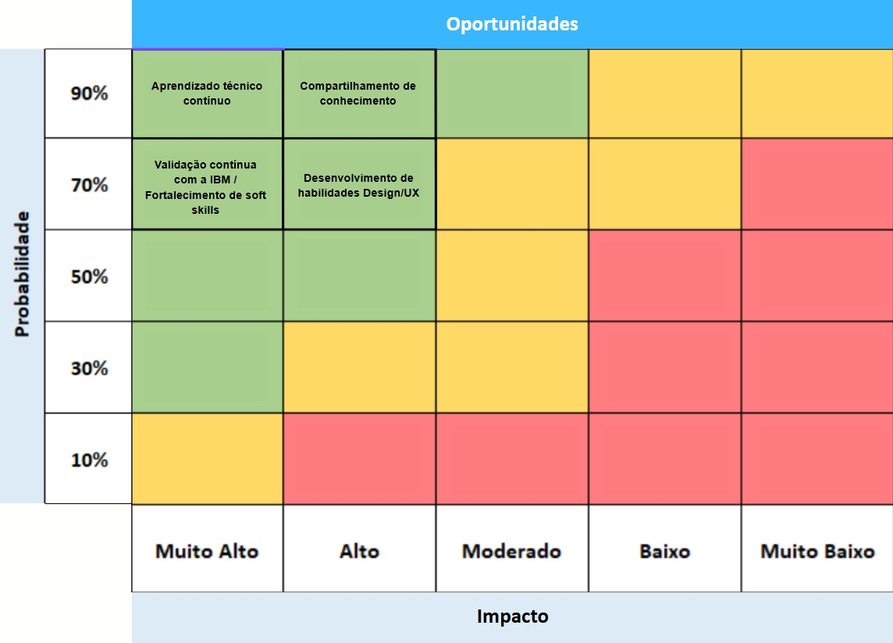

Fonte: AmnesIA, Inteli, 2026.

Descrição:

**1. Aprendizado técnico contínuo em desenvolvimento de jogos.**

Trata-se de uma oportunidade com probabilidade de 90% e impacto muito alto. A probabilidade é elevada porque o projeto exige que a equipe aprenda e aplique tecnologias novas a cada sprint, tornando o aprendizado técnico um resultado praticamente inevitável do processo. O impacto é muito alto porque as habilidades adquiridas, como o uso do Phaser 3, JavaScript orientado a cenas e design de jogos educacionais, ampliam significativamente o repertório técnico dos integrantes, com aplicação direta em projetos futuros.

**2. Compartilhamento de conhecimento entre os membros da equipe.**

Trata-se de uma oportunidade com probabilidade de 90% e impacto alto. A probabilidade é elevada pois a natureza multidisciplinar do projeto, envolvendo programação, design, narrativa e conteúdo pedagógico, cria naturalmente situações em que os membros precisam ensinar e aprender uns com os outros. O impacto é alto porque essa troca fortalece as competências individuais e coletivas do grupo, tornando a equipe mais versátil e colaborativa ao longo dos sprints.

**3. Validação contínua com o parceiro IBM a cada sprint.** 

Trata-se de uma oportunidade com probabilidade de 70% e impacto muito alto. A probabilidade é considerável pois o modelo de desenvolvimento por sprints já prevê momentos de apresentação e feedback com o parceiro, tornando essa validação parte estrutural do projeto. O impacto é muito alto porque o alinhamento contínuo com a IBM SkillsBuild permite corrigir desvios rapidamente, reduzindo o risco de retrabalho nas entregas finais e aumentando as chances de o produto final atender plenamente às expectativas do parceiro.

**4. Desenvolvimento de habilidades de design e experiência do usuário.**

Trata-se de uma oportunidade com probabilidade de 70% e impacto alto. A probabilidade é relevante pois o projeto demanda a criação de concept art, personagens e interfaces, atividades que colocam a equipe em contato direto com práticas de UX/UI e design de jogos. O impacto é alto porque essas habilidades, adquiridas de forma prática, ampliam o perfil profissional dos integrantes e são diretamente aplicáveis em projetos futuros nas áreas de tecnologia e design.

**5. Fortalecimento de soft skills por meio do trabalho colaborativo.**

Trata-se de uma oportunidade com probabilidade de 70% e impacto muito alto. A probabilidade é significativa pois o desenvolvimento em grupo ao longo de múltiplos sprints cria inevitavelmente situações que exigem comunicação, negociação e resolução de conflitos entre os integrantes. O impacto é muito alto porque o exercício dessas habilidades socioemocionais, como empatia, organização coletiva e trabalho em equipe, é essencial para a formação profissional dos membros e tem valor duradouro além do projeto.

Portanto, baseado na matriz de riscos apresentada, é possível concluir que a análise estruturada dos riscos, considerando tanto ameaças quanto oportunidades, permite uma visão mais clara das prioridades do projeto, contribuindo para um desenvolvimento mais consciente, organizado e alinhado aos objetivos do AMNES.IA e da parceria com a IBM SkillsBuild.


### 1.1.7. Objetivos, Metas e Indicadores 

## Objetivos estratégicos

- Promover o aprendizado ativo de Inteligência Artificial, por meio de mecânicas interativas e gamificadas.

- Garantir acessibilidade e inclusão no aprendizado, desenvolvendo uma experiência intuitiva e acessível para diferentes perfis de universitários.

- Assegurar a qualidade e a responsabilidade no ensino de IA, abordando conceitos corretos e destacando o impacto de decisões humanas nos sistemas inteligentes.

- Desenvolver uma experiência educacional inovadora, integrando narrativa, pixel art e mecânicas de jogo como forma de ensino.

- Consolidar o jogo como referência em ensino gamificado de IA, buscando alto engajamento e efetividade educacional.

## Metas SMART

- Atingir taxa de conclusão ≥ 75% dos usuários que iniciarem o jogo, medida por meio do Completion Rate (CR) registrado via eventos de início e término de jogo, em até 3 meses após o lançamento do MVP, por meio de melhorias iterativas na jogabilidade e balanceamento da dificuldade, mitigando os riscos de baixo engajamento e curva de dificuldade inadequada.

- Garantir que ≥ 70% dos jogadores avancem da Fase 1 para a Fase 2, medido pelo Level Conversion Rate (LCR) com base nos eventos de entrada e conclusão de fase, no primeiro mês após o início de uso, por meio de ajustes na interface e clareza das instruções, mitigando o risco de interface confusa ou pouco intuitiva.

- Alcançar tempo médio de sessão ≥ 10 minutos por usuário, medido pelo Average Session Duration (ASD) a partir do tempo total de jogo dividido pelo número de sessões, durante o primeiro mês após o lançamento, por meio da melhoria da interatividade e variedade das mecânicas, reduzindo o risco de jogo pouco atrativo ou repetitivo.

- Alcançar taxa de retenção ≥ 30% em 7 dias, medida pelo Retention Rate (D7) com base no retorno de usuários após a primeira interação, durante o primeiro mês após o lançamento, por meio de progressão motivadora e reforço de feedback ao jogador, mitigando o risco de baixa recorrência dos usuários.

- Aumentar em pelo menos 40% a retenção de conceitos de IA, medida pelo Learning Retention Rate (LRR) por meio da comparação entre pré-teste e pós-teste aplicados durante a experiência, ao longo da utilização do jogo, por meio de mecânicas educativas alinhadas aos conteúdos da IBM SkillsBuild, mitigando os riscos de conteúdo superficial/incorreto e complexidade na simulação de conceitos.

- Atingir taxa de acerto ≥ 80% nas mecânicas educativas, medida pelo Task Success Rate (TSR) com base nas interações corretas dos jogadores, durante as fases finais do jogo, por meio de feedback imediato e design pedagógico progressivo, mitigando o risco de baixa efetividade pedagógica.

- Alcançar ≥ 90% de aderência dos conteúdos aos módulos da IBM SkillsBuild, medida pelo Content Alignment Rate (CAR) com base em checklist comparativo validado, até o lançamento do MVP, por meio de revisão contínua dos conteúdos com base nos materiais oficiais, mitigando o risco de desalinhamento com a IBM.

- Obter NPS ≥ 60 ao final da experiência, medido por pesquisa aplicada ao usuário após a conclusão do jogo, nos primeiros 3 meses após o lançamento do MVP, por meio da melhoria contínua da experiência e usabilidade, mitigando o risco de baixa aceitação e percepção de valor.

- Garantir taxa de erros técnicos ≤ 5% das sessões, medida pelo Crash/Error Rate (CER) com base no número de sessões com falha sobre o total de sessões, nos primeiros 3 meses após o lançamento, por meio de testes em múltiplos navegadores e otimização do desempenho, mitigando riscos de performance, compatibilidade e falhas entre cenas.

## Indicadores (KPIs)
- Taxa de Conclusão (Completion Rate - CR): Percentual de jogadores que iniciam e finalizam todas as fases do jogo

Cálculo:
$$
CR = \frac{\text{Jogadores que completaram}}{\text{Jogadores que iniciaram}} \times 100
$$

- Taxa de Progressão por Fase (Level Conversion Rate - LCR): Percentual de usuários que avançam entre as fases do jogo (ex: da Fase 1 para a Fase 2)

Cálculo:
$$
LCR = \frac{\text{Jogadores que avançaram}}{\text{Jogadores da fase}} \times 100
$$

- Tempo Médio de Sessão (Average Session Duration - ASD): Tempo médio que usuário permanece no jogo por sessão

Cálculo:
$$
ASD = \frac{\text{Tempo total de jogo}}{\text{Número total de sessões}}
$$

- Taxa de Retenção em 7 dias (Retention Rate - D7): Percentual de usuários que retornam ao jogo após 7 dias da primeira interação

Cálculo:
$$
D7 = \frac{\text{Usuários que retornaram após 7 dias}}{\text{Usuários que iniciaram no dia 0}} \times 100
$$

- Retenção de Conhecimento (Learning Retention Rate - LRR): Medida da evolução do aprendizado do usuário, comparando desempenho antes e depois da experiência

Cálculo:
$$
LRR = \frac{\text{Pontuação pós-teste} - \text{Pontuação pré-teste}}{\text{Pontuação pré-teste}} \times 100
$$

- Taxa de Sucesso nas Mecânicas (Task Success Rate - TSR): Percentual de acertos do jogador nas mecânicas educativas do jogo

Cálculo:
$$
TSR = \frac{\text{Ações corretas}}{\text{Total de ações realizadas}} \times 100
$$

- Aderência de Conteúdo (Content Alignment Rate - CAR): Grau de alinhamento entre os conteúdos do jogo e os módulos da plataforma IBM SkillsBuild

Cálculo:
$$
CAR = \frac{\text{Itens de conteúdo alinhados}}{\text{Total de itens avaliados}} \times 100
$$

- NPS (Net Promoter Score): Grau de satisfação e recomendação do jogo pelos usuários

Cálculo:
$$
NPS = \% \text{Promotores} - \% \text{Detratores}
$$

- Taxa de Erros Técnicos (Crash/Error Rate - CER): Percentual de sessões em que ocorrem falhas técnicas, como travamentos ou erros de execução 

Cálculo:
$$
CER = \frac{\text{Sessões com erro}}{\text{Total de sessões}} \times 100
$$


## 1.2. Requisitos do Projeto 

Os requisitos são atributos necessários dentro de um sistema, que identifica a capacidade, característica e fator de qualidade para garantir a eficiência do desenvolvimento do jogo. (MORAES; LERMEN, 2021)

| #  | Requisito |
|----|------------|
| 1  | O jogo será disponibilizado na plataforma web da IBM, com acesso via computador. |
| 2  | O jogo deve abordar os conteúdos dos cursos apontados pela IBM por meio de frases progressivas. |
| 3  | O jogador poderá regular o volume pelo menu inicial. |
| 4  | O personagem irá navegar pelo espaço do jogo através do uso das teclas de seta. |
| 5  | Para realizar os puzzles, o jogador deverá utilizar o mouse. |
| 6  | O jogador acessa as fases através das abas do computador do personagem. |
| 7  | O jogador deve seguir a sequência dos puzzles que estão divididos por nível crescente de dificuldade. |
| 8  | O jogo deve finalizar quando o personagem finalizar os mini puzzles de cada fase. |
| 9  | Ao final do jogo, é esperado que o jogador aprenda sobre os conceitos iniciais sobre IA baseado no curso da IBM SkillsBuild. |

## 1.3. Público-alvo do Projeto 

O público-alvo do jogo é composto majoritariamente por jovens universitários, com faixa etária entre 18 e 25 anos, matriculados em cursos relacionados à tecnologia, que demonstram interesse em Inteligência Artificial, programação e inovação.

Do ponto de vista demográfico, esse grupo caracteriza-se por alta familiaridade com o mundo digital, acesso frequente à internet e consumo recorrente de jogos como forma de lazer e aprendizado. Mais de 60% das pessoas entre 16 e 30 anos jogam regularmente, sendo os jogos digitais uma das principais formas de entretenimento dessa faixa etária. (FORBES, 2026)

Em relação às preferências e gostos pessoais, esse público tende a valorizar experiências interativas que combinem desafios, resolução de problemas e raciocínio lógico, características alinhadas à proposta do jogo, que busca integrar conceitos de Inteligência Artificial com mecânicas lúdicas. Jogos com componentes de aprendizagem (game-based learning) demonstram maior engajamento entre estudantes universitários, pois favorecem a motivação intrínseca e a assimilação de conteúdos técnicos de forma prática e contextualizada.

Além disso, a escolha desse público se justifica pelo potencial de aplicação acadêmica do jogo como ferramenta de apoio ao ensino, possibilitando a consolidação de conceitos teóricos de IA por meio de simulações e desafios interativos.

Dessa forma, o projeto direciona seu design, linguagem visual e nível de complexidade para atender às expectativas desse perfil, priorizando mecânicas estratégicas, feedback imediato e conteúdos relacionados ao mundo da tecnologia.

# <a name="c2"></a>2. Visão Geral do Jogo 

## 2.1. Objetivos do Jogo 

No contexto do nosso jogo, o objetivo lusório consiste em avançar pelas fases ao resolver corretamente os minigames propostos, aplicando os conceitos introdutórios de Inteligência Artificial apresentados ao longo da experiência. Para isso, o jogador precisa interpretar os desafios, tomar decisões e utilizar apenas as mecânicas e interações disponíveis no próprio jogo. Assim, o progresso não depende apenas de chegar ao final das fases, mas de conseguir superar os desafios respeitando as regras e a lógica estabelecida pela dinâmica do jogo.

## 2.2. Características do Jogo 

### 2.2.1. Gênero do Jogo 

Nosso projeto é adequadamente classificado como um jogo educacional, pois seu principal objetivo é ensinar a base da Inteligência Artificial para iniciantes, utilizando mecânicas interativas e minigames como forma de engajamento e fixação de conteúdo. A aprendizagem é parte central da experiência, integrada diretamente às dinâmicas propostas, e não tratada como um elemento secundário. Além disso, a proposta contará com subgêneros que variam de acordo com o contexto e os objetivos de cada fase. Por exemplo, a primeira fase se enquadra no subgênero puzzle, ao desafiar o jogador a organizar corretamente os cards com conceitos de IA para estabelecer conexões lógicas e permitir o fluxo de energia até o computador, exigindo raciocínio, atenção e associação de ideias para avançar.

### 2.2.2. Plataforma do Jogo 

O nosso jogo foi pensado para rodar em desktops e notebooks, em razão da necessidade de uma interface mais ampla e organizada, que facilite a visualização dos cards, conexões e elementos interativos presentes nos minigames. Como a proposta envolve leitura de conteúdos introdutórios sobre IA, organização de informações e interação precisa com diferentes componentes na tela, o uso de teclado e mouse proporciona maior controle, conforto e precisão nas ações do jogador, além de oferecer uma experiência mais fluida e adequada ao ambiente educacional para o qual o jogo foi projetado. O game é executado diretamente no navegador, sendo compatível com os principais browsers atuais, como Google Chrome, Microsoft Edge, Mozilla Firefox e Opera, garantindo fácil acesso sem a necessidade de instalação adicional de programas.

### 2.2.3. Número de jogadores 

Nosso jogo é caracterizado como singleplayer (1 jogador), pois toda a experiência é estruturada para que o usuário avance individualmente pelos minigames educativos voltados à introdução à Inteligência Artificial. Não há modos competitivos, cooperativos ou multiplayer, já que o foco está na jornada individual de aprendizagem, priorizando a concentração, o raciocínio lógico e a assimilação gradual do conteúdo, permitindo que cada jogador evolua no próprio ritmo conforme supera os desafios propostos.

### 2.2.4. Títulos semelhantes e inspirações 

Um jogo utilizado como referência para o desenvolvimento do nosso primeiro mini game é o puzzle online Power Flow (Uptodown, 2024). Trata-se de um jogo focado em circuitos elétricos, no qual o objetivo é construir um sistema de fluxo capaz de fornecer energia a um aparelho específico. O jogador inicia com uma fonte de energia e deve conduzir a eletricidade até o dispositivo final. 

Para isso, conta com diferentes componentes que podem ser manipulados e ajustados livremente, permitindo montar o circuito da forma mais eficiente possível. Um ponto essencial da dinâmica é que a corrente elétrica deve sempre fluir na mesma direção, o que exige atenção na escolha e no posicionamento de cada peça para que o sistema funcione corretamente. Além disso, cada fase possui um limite de tempo, tornando a experiência mais dinâmica e desafiadora.

De maneira semelhante, em nosso jogo o jogador precisa organizar corretamente os cards com conteúdos sobre IA nos locais adequados. À medida que as escolhas são feitas de forma correta, os cabos de energia são conectados progressivamente, estabelecendo o fluxo necessário para ligar o computador. Assim como em Power Flow, a lógica, a organização e a atenção aos detalhes são fundamentais para alcançar o objetivo final.

### 2.2.5. Tempo estimado de jogo 

O jogo pode ser concluído em aproximadamente 7 minutos, com máxima de 20 minutos.  
A cada cena do personagem no quarto  até começar os minigames dura aproximadamente de 20 segundos até 1 minutos. 
O primeiro minigame dura de 2 a 6 minutos
O segundo minigame de 1 a 3 minutos 
O terceiro minigame dura de 1 a 5 minutos
O quarto minigame dura de 3 a 15 minutos  
Essa duração pode variar de acordo com o desempenho do jogador, especialmente em relação à resolução dos desafios e ao nível de familiaridade com as mecânicas propostas.


# <a name="c3"></a>3. Game Design 

## 3.1. Enredo do Jogo 

O jogo começa com um universitário do primeiro ano da faculdade que precisa apresentar um seminário sobre Inteligência Artificial. Por ser sua primeira grande apresentação acadêmica, ele sente que precisa provar sua capacidade diante dos professores e colegas. Na noite anterior ao seminário, o estudante passou horas estudando intensamente. Determinado a não cometer erros, ele revisa cada slide, cada anotação e cada detalhe do conteúdo. O medo de falhar e a pressão por um bom desempenho fazem com que ele ultrapasse seus próprios limites.

Na manhã seguinte, ao acordar para o dia da apresentação, ele percebe algo alarmante que não consegue se lembrar de nada do conteúdo que estudou. Seu cérebro sofreu um episódio raro de amnésia temporária causada por estresse extremo e exaustão mental. Houve um bloqueio temporário no acesso às memórias recentes, principalmente aquelas relacionadas à Inteligência artificial. E com ajuda de seu computador, que tinha os materiais necessários da IBM, aos poucos ele vai recuperando a memória.

Conforme o jogador avança e recupera os fragmentos perdidos, o personagem começa a retomar sua confiança. O momento decisivo ocorre quando a barra de reconstrução é completada, indicando que o conhecimento foi reorganizado.
No final, o estudante vai para o seminário mais calmo e preparado, compreendendo que o conteúdo nunca havia desaparecido, apenas estava temporariamente inacessível devido ao excesso de pressão.

## 3.2. Personagens 

### 3.2.1. Controláveis

No jogo, o estudante universitário pode ser representado por três personagens jogáveis, cada um expressando uma dimensão interna necessária para superar o bloqueio de memória causado pelo estresse e. Essas representações não são apenas mecânicas, mas também simbólicas, dialogando com a realidade social brasileira e com o público-alvo composto por jovens estudantes.

O primeiro personagem, um jovem pardo, representa equilíbrio e pensamento lógico. Ele possui atributos médios, sendo indicado para jogadores que preferem estabilidade e controle. Sua representação dialoga com a realidade de muitos jovens pardos no Brasil que, apesar dos avanços nas políticas de democratização do ensino superior, ainda enfrentam desigualdades estruturais no percurso educacional. Dados do IBGE indicam que ainda existem diferenças na taxa de conclusão do ensino superior quando analisadas por raça/cor, evidenciando desigualdades históricas no acesso à educação, na qualidade do ensino básico e nas condições socioeconômicas que influenciam a permanência na universidade. (IBGE, 2026)

A segunda personagem, uma jovem branca ruiva, simboliza agilidade e criatividade. Possui maior velocidade e melhor desempenho em desafios temporizados, representando adaptação e rapidez de raciocínio. Sua presença dialoga com a discussão sobre a sub-representação feminina nas áreas de Tecnologia, Engenharia e Matemática . Relatórios da UNESCO apontam que mulheres ainda são minoria em cursos e carreiras tecnológicas em diversas regiões do mundo, o que evidencia barreiras culturais, sociais e estruturais que dificultam sua permanência e ascensão nesses campos. Ao incluí-la como personagem jogável, o jogo reforça a importância da participação feminina na produção tecnológica.(Guia do Estudante, 2026)

A terceira personagem, uma jovem negra, representa resiliência e força emocional. Possui maior resistência e melhor desempenho em áreas de maior dificuldade, simbolizando persistência diante de obstáculos. Essa construção dialoga com dados que demonstram que mulheres negras estão entre os grupos mais impactados por desigualdades de renda, oportunidades e acesso à educação no Brasil. Estudos do IPEA destacam como raça e gênero influenciam trajetórias educacionais e profissionais, revelando que mulheres negras frequentemente enfrentam múltiplas camadas de desigualdade. Ao representá-la como protagonista forte e capaz, o jogo busca valorizar essa resistência e promover uma narrativa inclusiva.(IPEA, 2022)

Dessa forma, os personagens não apenas enriquecem a jogabilidade, mas também contribuem para uma reflexão crítica sobre diversidade, equidade e acesso à educação no contexto brasileiro.

Figura 5: Personagens do jogo Amnes.IA

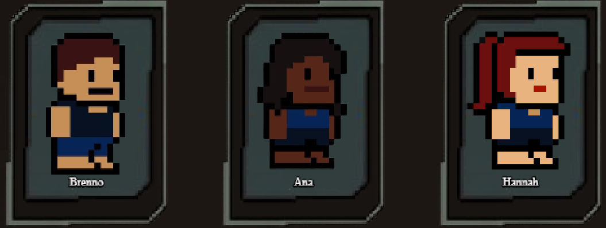

Fonte: AmnesIA, Inteli, 2025.


### 3.2.2. Non-Playable Characters (NPC)

O jogo não possui personagens não jogáveis (NPCs), como coadjuvantes ou personagens de apoio ao longo das fases. Essa decisão está alinhada ao foco do projeto, que prioriza mecânicas educativas e interativas, nas quais o jogador aprende por meio da execução direta das atividades propostas, sem a necessidade de interação com outros personagens. Além disso, a experiência é construída principalmente por meio de minigames e elementos visuais, como ícones, objetos e interfaces, que são responsáveis por transmitir, de forma prática e intuitiva, os conceitos de Inteligência Artificial.

### 3.2.3. Diversidade e Representatividade dos Personagens

A diversidade presente nos personagens está alinhada ao público-alvo do jogo, composto principalmente por estudantes que vivenciam pressão acadêmica e desafios emocionais. O Brasil é um país marcado por grande diversidade racial e por desigualdades sociais estruturais que influenciam o acesso à educação e às oportunidades profissionais. Estudos publicados pelo Instituto de Pesquisa Econômica Aplicada (IPEA), como o relatório Retrato das Desigualdades de Gênero e Raça, demonstram que renda, raça e gênero continuam sendo fatores determinantes nas trajetórias educacionais e no acesso a posições de maior qualificação no mercado de trabalho. (IPEA, 2022)

Ao representar personagens pardos, negros e femininos como protagonistas competentes e capazes, o jogo busca promover identificação e inclusão, evitando estereótipos e reforçando que talento e capacidade intelectual não estão vinculados à cor da pele, ao gênero ou à condição socioeconômica. Essa escolha contribui para ampliar a representatividade dentro do universo da tecnologia, área que historicamente apresenta desigualdades de participação.

O impacto esperado é fortalecer a sensação de pertencimento entre jogadores de diferentes origens, estimular reflexão crítica sobre desigualdade educacional e incentivar a formação de desenvolvedores mais conscientes de seu papel social na construção de tecnologias mais equitativas e inclusivas.


## 3.3. Mundo do jogo 

### 3.3.1. Locações Principais e/ou Mapas 

O jogo se passa principalmente no quarto do jovem universitário, um espaço que combina elementos de estudo e vida pessoal. A estante está cheia de livros, cadernos e plantas, na escrivaninha o computador se destaca. O ambiente, embora simples, transmite familiaridade e intimidade, reforçando a sensação de que cada objeto faz parte da rotina do personagem. Detalhes como o mural na parede, a cama e o gato de estimação no tapete tornam a exploração mais envolvente.

Figura 6: Quarto do personagem do jogo.

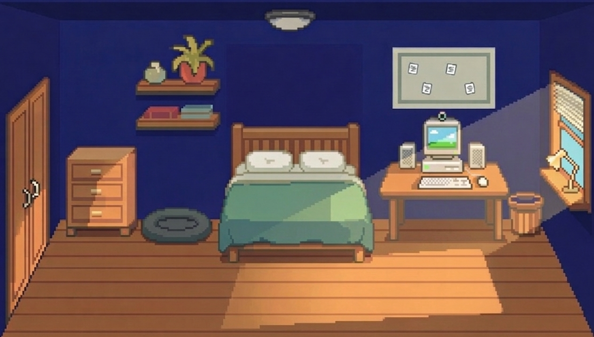

Fonte: AmnesIA, Inteli, 2025.

O computador pode ser interpretado como uma porta para o mundo digital do jogo. Ao ligá-lo, o jogador acessa diferentes abas do navegador, que representam fases e desafios para recuperar os fragmentos de memória perdidos do protagonista. Cada aba contém mini puzzles que, quando completados, desbloqueiam conhecimento e avançam a narrativa. 

Figura 7: Fundo do jogo um.

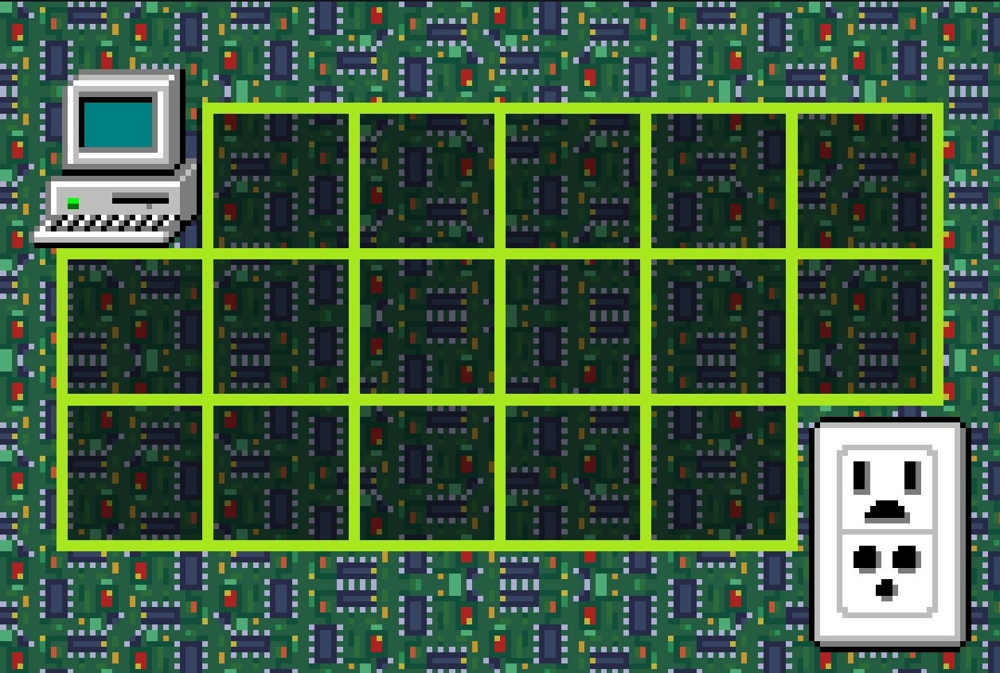

Fonte: AmnesIA, Inteli, 2025.

Figura 8: Fundo do jogo dois.


Fonte: AmnesIA, Inteli, 2025.

Figura 9: Fundo do jogo três.


Fonte: AmnesIA, Inteli, 2025.

Figura 10: Fundo do jogo quatro.


Fonte: AmnesIA, Inteli, 2025.

Assim, mesmo em um único ambiente físico, o jogo consegue criar sensação de progresso e diversidade de experiências, transformando o quarto em um verdadeiro espaço de exploração cognitiva.

### 3.3.2. Navegação pelo mundo 

A movimentação no jogo é intuitiva e conecta o jogador à experiência do protagonista. O personagem se desloca pelo quarto usando as setas do teclado, aproximando-se de elementos interativos como a escrivaninha, enquanto a tecla E permite ligar o computador e iniciar a exploração digital. 
Dentro do PC, o mouse é usado para interagir com os cards e mini puzzles das abas. Cada ação do jogador reflete a reconstrução gradual do conhecimento perdido, tornando a exploração significativa dentro do contexto narrativo.

O acesso às fases é progressivo e simbólico: inicialmente, apenas o circuito para ligar o computador está disponível, enquanto as demais abas permanecem bloqueadas. Conforme os puzzles são resolvidos, novas abas são liberadas, permitindo que o personagem recupere mais fragmentos de memória e avance na narrativa. 

Esse sistema cria uma relação clara entre espaço físico e espaço digital, mostrando que cada aba do navegador possui um propósito específico no desenvolvimento do aprendizado.

### 3.3.3. Condições climáticas e temporais 

Neste jogo, o clima não será relacionado com a jogabilidade. Ou seja, não haverá mudanças como chuva, sol, noite, neblina ou qualquer outro tipo de condição climática que afete o mundo ou as fases.

Além disso, o tempo também não será um fator limitante. O jogador não terá contagem regressiva nem prazo para terminar as fases, podendo jogar no seu próprio ritmo.

Dessa forma, o foco do jogo permanece apenas nas ações do jogador e no avanço pelas cenas, sem influência de clima ou sistema de tempo.

### 3.3.4. Concept Art 

Concept Art refere-se ao processo de criação visual preliminar utilizado no desenvolvimento de jogos digitais, filmes e outras produções audiovisuais. Seu objetivo é representar graficamente personagens, cenários, objetos e atmosferas que irão compor o universo do projeto, servindo como base visual para orientar as etapas posteriores de produção. No contexto do desenvolvimento de jogos, o concept art auxilia na definição da identidade estética, permitindo explorar diferentes ideias visuais antes da implementação final dos elementos dentro do jogo.

Figura 11: ideia de futuro minigame para o jogo.

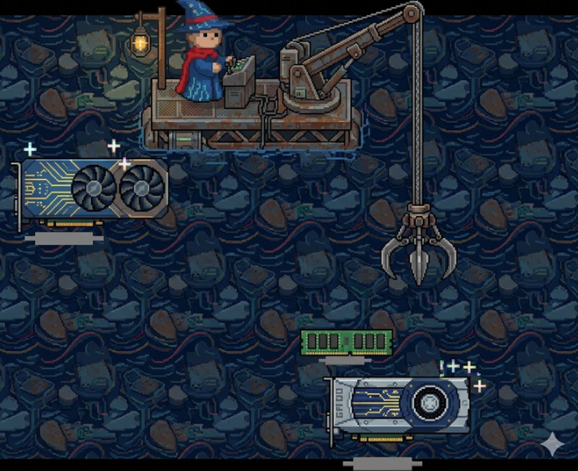

Fonte: AmnesIA, Inteli, 2025.

Figura 12: ideia do funcionamento das fases por abas do computador.

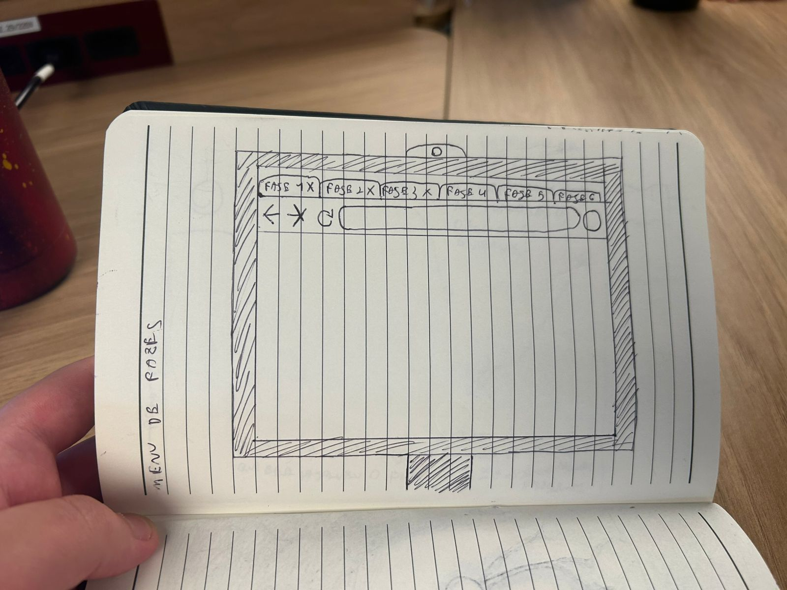

Fonte: AmnesIA, Inteli, 2025.

Figura 13: ideia da fase um.

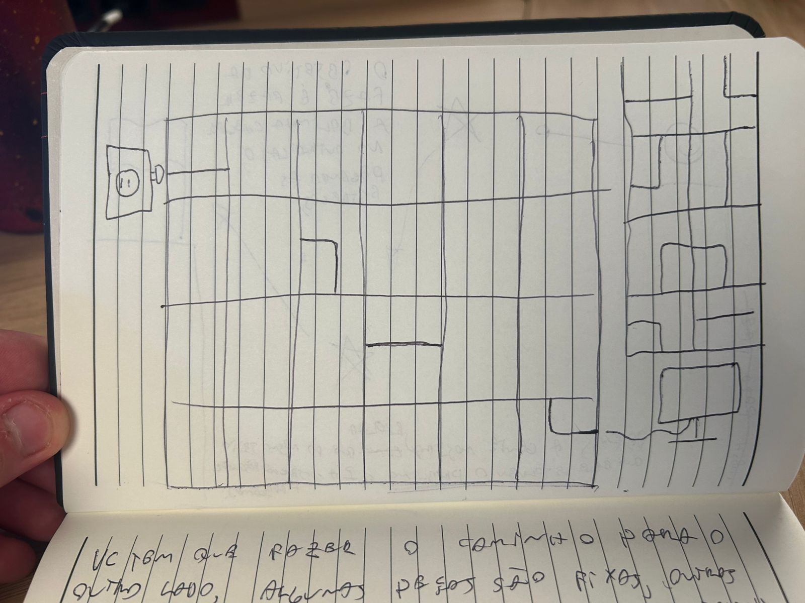

Fonte: AmnesIA, Inteli, 2025.

Figura 14: ideia do quadro de conteúdo para o entre fases.

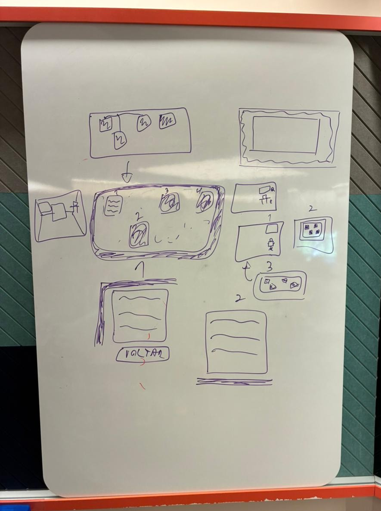

Fonte: AmnesIA, Inteli, 2025.

### 3.3.5. Trilha sonora 

O jogo conta com trilha sonora em estilo 8-bit, reforçando a estética retrô e arcade da experiência. As faixas foram selecionadas para acompanhar a progressão emocional da narrativa: começando com um clima leve e nostálgico na tela inicial, passando por uma atmosfera introspectiva durante a exploração do quarto, e escalando gradualmente em tensão e intensidade conforme o jogador avança pelas fases até o confronto final com o boss. Todas as faixas foram obtidas na plataforma Pixabay, sob licença gratuita para uso em projetos, e são de autoria do produtor moodmode.

\# | Título | Ocorrência | Autoria
--- | --- | --- | ---
1 | 8 Bit Retro Game Music | Tela de início e seleção de personagens | MoodMode (Pixabay)
2 | 8-bit Arcade Mode | Cutscene e exploração do quarto | MoodMode (Pixabay)
3 | Level 1 | Fase 1 – Puzzle de cards | MoodMode (Pixabay)
4 | Level 2 | Fase 2 – Garra mecânica | MoodMode (Pixabay)
5 | Level 3 | Fase 3 – Conexão de fios | MoodMode (Pixabay)
6 | Level 4 | Fase 4 – Boss final (IA corrompida) | MoodMode (Pixabay)

## 3.4. Inventário e Bestiário 

### 3.4.1. Inventário

O jogo não possui um sistema de inventário. Essa escolha está relacionada ao foco do projeto em mecânicas educativas simples e diretas, nas quais o jogador interage com os elementos presentes em cada fase sem a necessidade de armazenar ou gerenciar itens ao longo da progressão. Dessa forma, não há coleta permanente de objetos, poderes ou recursos, uma vez que cada minigame é projetado para trabalhar conceitos específicos de Inteligência Artificial de maneira independente e contextualizada.

### 3.4.2. Bestiário

O jogo não possui um bestiário tradicional, uma vez que não apresenta uma variedade de inimigos recorrentes ao longo das fases. No entanto, na etapa final, há a presença de um único inimigo, caracterizado como o boss do jogo. Esse antagonista representa uma Inteligência Artificial corrompida, construída a partir de dados incorretos ou mal selecionados, e tem como função consolidar os conceitos trabalhados nas fases anteriores. Seu comportamento e nível de dificuldade refletem as consequências de um treinamento inadequado, reforçando, de forma prática, a importância da qualidade dos dados no desenvolvimento de sistemas de Inteligência Artificial.

\# | inimigo |  | ocorrências | função | impacto | efeito sonoro
--- | --- | --- | --- | --- | --- | ---
1 | IA Corrompida (Boss Final) | 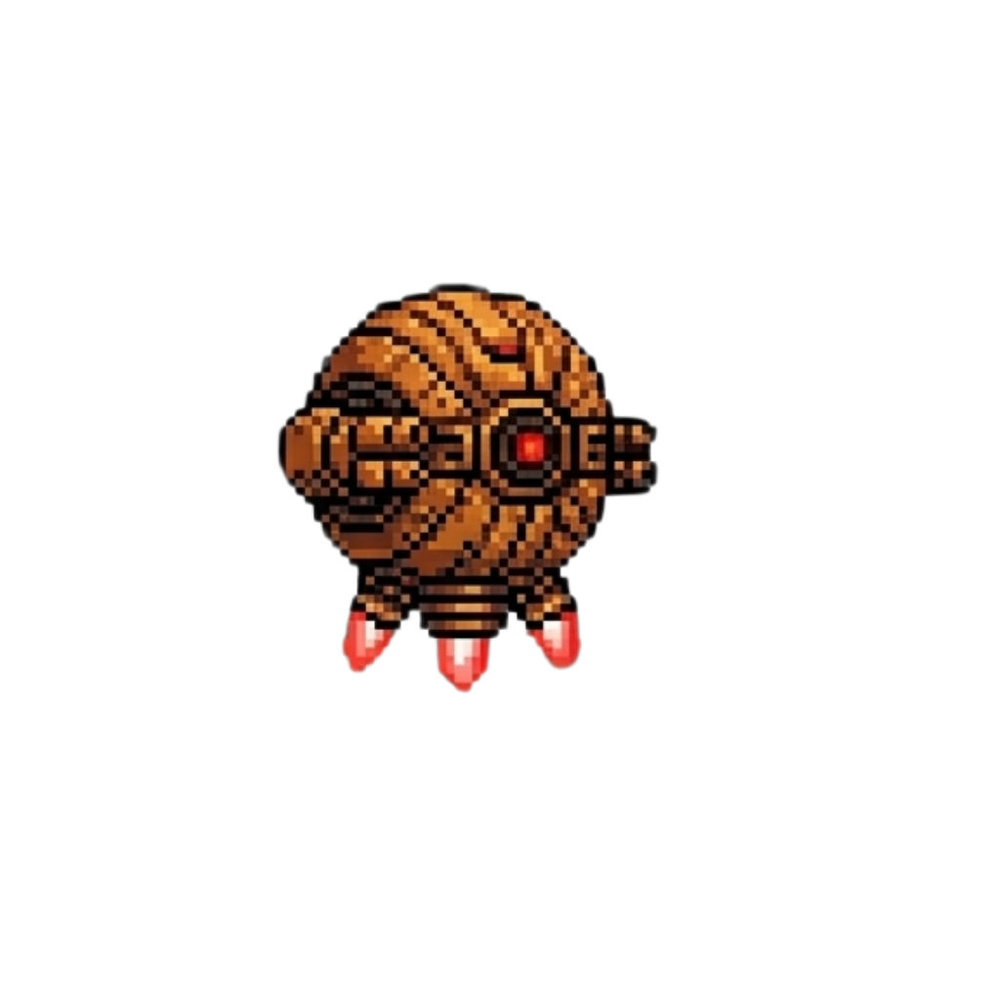 |  exclusivo da fase 5 | Ataca o protagonista deslocando-se livremente pelo cenário com movimentação aérea contínua, direcionando projéteis de glitch ao jogador | ao ser atingido pelos projéteis (glitch), o jogador perde pontos de vida de uma barra total de 100 pontos, sendo derrotado caso essa barra chegue a zero | Não há efeito sonoro próprio, apenas a trilha sonora da fase

## 3.5. Gameflow (Diagrama de cenas) 

Figura 15: Diagrama de Cenas do jogo Amnes.IA.


Fonte: AmnesIA, Inteli, 2025.

## 3.6. Regras do jogo 

Após clicar em Play, o jogador inicia sua jornada no quarto, onde pode explorar o ambiente utilizando as setas do teclado. O primeiro objetivo é aproximar-se do computador e pressionar a tecla E para acessar o mundo digital. A progressão do jogo ocorre por meio de fases organizadas em abas do computador, sendo que cada fase contém um mini game educativo relacionado aos fundamentos da Inteligência Artificial.

Para avançar, o jogador deve concluir corretamente os desafios propostos em cada minigame. Na primeira fase, por exemplo, é necessário arrastar os cartões corretos até o circuito do computador, estabelecendo as conexões. Apenas quando todas as conexões corretas são realizadas, a fase é concluída e a próxima aba é desbloqueada.

As fases seguem uma progressão sequencial, ou seja, precisam ser concluídas na ordem correta e não podem ser acessadas fora dessa sequência. O jogador não possui limite de tempo para completar os desafios, podendo avançar no seu próprio ritmo e explorar cada etapa com tranquilidade. Caso um card seja posicionado de forma incorreta, o sistema simplesmente não registra progresso, incentivando o jogador a tentar novamente até encontrar a resposta correta.

O jogo chega ao fim quando todas as fases são concluídas, representando a reconstrução completa da memória do personagem. Ao longo dos desafios, cada acerto contribui para que ele recupere gradualmente suas lembranças e organize seus conhecimentos. Assim, ao finalizar todas as etapas, o personagem finalmente se sente confiante e preparado para apresentar seu seminário sobre Inteligência Artificial.

## 3.7. Mecânicas do jogo 

As mecânicas do jogo são regras e ações que determinam quais interações o jogador pode realizar com o universo do jogo para alcançar os objetivos.

---

**Geral**

| # | Ação | Comportamento |
|---|------|---------------|
| 1 | Pressionar tecla W | Anda para cima |
| 2 | Pressionar tecla S | Anda para baixo |
| 3 | Pressionar tecla A | Anda para esquerda |
| 4 | Pressionar tecla D | Anda para direita |
| 5 | Pressionar tecla *E* | Abre o computador; indica que entendeu o comando |
| 6 | Clicar em botões com o mouse | Abre próxima tela |

---

**Cutscene**

| # | Ação | Comportamento |
|---|------|---------------|
| 1 | Clicar no botão *Next* | Avança para o próximo card da história |

---

**Fase Um**

| # | Ação | Comportamento |
|---|------|---------------|
| 1 | Clicar e arrastar os cards com o cursor do mouse | Card é arrastado de acordo com a posição do mouse |

---

**Fase Dois**

| # | Ação | Comportamento |
|---|------|---------------|
| 1 | Pressionar tecla W | Garra mecânica sobe |
| 2 | Pressionar tecla S | Garra mecânica desce |
| 3 | Pressionar tecla *Esc* | Inicia a fase novamente |
| 4 | Clicar no elemento dourado com o mouse | Abre o card |
| 5 | Clicar no "X" com o mouse | Fecha o card |

---

**Fase Três**

| # | Ação | Comportamento |
|---|------|---------------|
| 1 | Clicar na tecla *Espaço* | Pega o fio/Conecta o fio |
| 2 | Clicar na tecla *X* | Desfaz o fio |

---

**Fase Quatro**

| # | Ação | Comportamento |
|---|------|---------------|
| 1 | Clicar na tecla *Espaço* | Lança tiros no boss |
| 2 | Clicar nas alternativas com o mouse | Seleciona qual alternativa foi escolhida |

---

**Tela Quadro**

| # | Ação | Comportamento |
|---|------|---------------|
| 1 | Clicar na tecla *Q* | Inicia a tela do quadro |
| 2 | Clicar nos cards com o mouse | Abre/fecha card do resumo dos tópicos |

## 3.8. Implementação Matemática de Animação/Movimento 

Obs: Favor abrir no VsCode, porque algumas formatações de fórmulas não estão sendo reconhecidas. Ao abrir o arquivo, clique no botão direito do mouse em cima de gdd.md e clique em "Open Preview".

---

## 3.8.1. Room — Fase do Quarto

### Descrição geral

A cena do quarto é a fase de navegação do jogo. O personagem se movimenta livremente por um ambiente 2D com restrição de área, animações baseadas em estado e detecção de proximidade com objetos interativos.

---

### Recorte de frames do spritesheet por progressão aritmética

Os frames do personagem são recortados de uma spritesheet usando progressão aritmética para calcular a posição X de cada frame:

**Posição X do frame $i$:**

$$X_i = startX + i \times frameW$$

Onde:
- $startX$ é a posição inicial do primeiro frame na spritesheet
- $frameW$ é a largura de cada frame
- $i$ é o índice do frame

Para o personagem 1 ($startX = 0$, $frameW = 130$):

| Frame | Cálculo | Posição X |
|---|---|---|
| 0 | $0 + 0 \times 130$ | $0$ px |
| 1 | $0 + 1 \times 130$ | $130$ px |
| 2 | $0 + 2 \times 130$ | $260$ px |
| 7 | $0 + 7 \times 130$ | $910$ px |

**Implementação:**
```javascript
for (let i = 0; i < config.frames; i++) {
    tex.add(i, 0, config.startX + i * config.frameW, config.y, config.frameW, config.h);
}
```

---

### Movimentação do personagem — Movimento Retilíneo Uniforme (MRU)

O personagem se move com velocidade constante nos quatro sentidos, sem aceleração, caracterizando um **Movimento Retilíneo Uniforme (MRU)**:

$$V_x = \pm 160 \text{ px/s}, \quad V_y = \pm 160 \text{ px/s}$$

**Deslocamento em um intervalo de tempo $\Delta t$:**

$$\Delta x = V_x \times \Delta t, \quad \Delta y = V_y \times \Delta t$$

Onde:
- Quando nenhuma tecla está pressionada, $V_x = V_y = 0$ instantaneamente

**Implementação:**
```javascript
if (this.cursors.left.isDown)       this.player.setVelocityX(-160);
else if (this.cursors.right.isDown) this.player.setVelocityX(160);
else                                this.player.setVelocityX(0);

if (this.cursors.up.isDown)         this.player.setVelocityY(-160);
else if (this.cursors.down.isDown)  this.player.setVelocityY(160);
else                                this.player.setVelocityY(0);
```

---

### Restrição de área de movimento — Função Clamp

O personagem é limitado a um retângulo de movimento:

$$X_{min} = 65 \text{ px}, \quad X_{max} = 65 + 900 = 965 \text{ px}$$
$$Y_{min} = 400 \text{ px}, \quad Y_{max} = 400 + 100 = 500 \text{ px}$$

A função Clamp garante que a posição do personagem respeite esses limites:

$$X_{final} = \max(X_{min},\ \min(X_{max},\ X_{atual}))$$
$$Y_{final} = \max(Y_{min},\ \min(Y_{max},\ Y_{atual}))$$

**Implementação:**
```javascript
this.player.x = Phaser.Math.Clamp(this.player.x, this.areaMovimento.x, this.areaMovimento.x + this.areaMovimento.width);
this.player.y = Phaser.Math.Clamp(this.player.y, this.areaMovimento.y, this.areaMovimento.y + this.areaMovimento.height);
```

---

### Detecção de proximidade — Distância Euclidiana

A visibilidade do ícone de tecla é ativada quando o jogador se aproxima do computador, usando a fórmula da distância euclidiana:

$$d = \sqrt{(x_2 - x_1)^2 + (y_2 - y_1)^2}$$

Onde:
- $(x_1, y_1)$ é a posição atual do jogador
- $(x_2, y_2) = (750, 300)$ é a posição do computador
- Se $d \leq 200$ px, o ícone de tecla se torna visível

**Implementação:**
```javascript
const distancia = Phaser.Math.Distance.Between(player.x, player.y, 750, 300);
if (distancia <= 200) { this.tecla.setVisible(true); }
```

---

### Movimento oscilatório da exclamação

O ícone de exclamação realiza um movimento oscilatório vertical contínuo:

$$A = 150 - 140 = 10 \text{ px}, \quad T = 2 \times 1200 = 2400 \text{ ms}$$

**Implementação:**
```javascript
this.tweens.add({ targets: this.exclamacao, y: 150, duration: 1200, yoyo: true, repeat: -1 });
```

---

### Tabela de elementos matemáticos — Room

| Elemento | Tipo de matemática | Valores |
|---|---|---|
| Recorte de frames | Progressão aritmética | $X_i = startX + i \times frameW$ |
| Movimentação | MRU (4 sentidos) | $V_x = V_y = \pm 160$ px/s |
| Área de movimento | Função Clamp | $X \in [65, 965]$, $Y \in [400, 500]$ |
| Oscilação da exclamação | Movimento oscilatório | $A = 10$ px, $T = 2400$ ms |
| Detecção de proximidade | Distância euclidiana | Limiar $d \leq 200$ px |

---

## 3.8.2. PhaseOne — Fase dos Fios

### Descrição geral

A primeira fase jogável apresenta um sistema de arrastar e soltar cards para completar um circuito. O jogador deve identificar o card correto e arrastá-lo até o alvo correspondente. A cena utiliza progressão aritmética para posicionamento, distância euclidiana para detecção de acerto e tweens com easing para animação de retorno.

---

### Distribuição dos cards por progressão aritmética

Os 4 cards são distribuídos verticalmente com espaçamento constante de 110 px:

$$Y_i = 180 + i \times 110$$

Onde:
- $180$ px é a posição Y do primeiro card
- $110$ px é o espaçamento fixo entre cards
- $i$ é o índice do card (0 a 3)

| Card | Cálculo | Posição Y |
|---|---|---|
| 0 | $180 + 0 \times 110$ | $180$ px |
| 1 | $180 + 1 \times 110$ | $290$ px |
| 2 | $180 + 2 \times 110$ | $400$ px |
| 3 | $180 + 3 \times 110$ | $510$ px |

**Implementação:**
```javascript
// Confirmado na função iniciarRodada():
c.y = 180 + (i * 110);
```

---

### Detecção de acerto — Distância Euclidiana

O acerto é detectado quando a distância entre o card arrastado e o alvo é menor que 50 px:

$$d = \sqrt{(x_{card} - x_{alvo})^2 + (y_{card} - y_{alvo})^2}$$

- Se $d < 50$ px → acerto registrado, rodada avança
- Se $d \geq 50$ px → card retorna à posição original

**Implementação:**
```javascript
if (!this.acertou && distancia < 50) { ... }
if (indice !== cardCerto || distancia >= 50) { /* devolve card */ }
```

---

### Retorno animado dos cards — Tween com Easing Back.Out

Quando um card errado é solto fora do alvo, ele retorna com curva `Back.Out`:

$$X_{destino} = 140 \text{ px}, \quad Y_{destino} = 180 + indice \times 110, \quad t_{retorno} = 300 \text{ ms}$$

**Implementação:**
```javascript
this.tweens.add({ targets: gameObject, x: 140, y: 180 + indice * 110, duration: 300, ease: 'Back.Out' });
```

---

### Feedback visual de hover — Variação de escala

$$\Delta scale = \frac{0{,}12 - 0{,}11}{0{,}11} \approx 9{,}1\%$$

**Implementação:**
```javascript
this.card[i].on("pointerover", () => { this.card[i].setScale(0.12); });
this.card[i].on("pointerout",  () => { this.card[i].setScale(0.11); });
```

---

### Controle de rodadas por índice

$$rodadaAtual \in \{0, 1, 2, 3, 4, 5, 6, 7\}$$
$$\text{Se } rodadaAtual \geq rodadas.length \Rightarrow \text{fase concluída}$$

**Implementação:**
```javascript
this.rodadaAtual++;
if (this.rodadaAtual >= this.rodadas.length) { ... }
```

---

### Tabela de elementos matemáticos — PhaseOne

| Elemento | Tipo de matemática | Valores |
|---|---|---|
| Distribuição dos cards | Progressão aritmética | $Y_i = 180 + i \times 110$ |
| Detecção de acerto | Distância euclidiana | Limiar $d < 50$ px |
| Retorno dos cards | Tween com easing Back.Out | $t = 300$ ms |
| Feedback de hover | Variação de escala | $\Delta scale \approx 9{,}1\%$ |
| Delay entre rodadas | Intervalo fixo | $t_{delay} = 800$ ms |
| Controle de rodadas | Índice de array | 8 rodadas, $0 \leq i \leq 7$ |

---

## 3.8.3. PhaseTwo — Fase da Pesca

### Descrição geral

A segunda fase jogável apresenta um minigame de pesca onde o jogador controla um anzol verticalmente para capturar elementos que se movem horizontalmente. Combina MRU vertical (anzol) e MRU horizontal (peixes), hitboxes circulares, progressão aritmética e acumulação de pontuação.

---

### Movimentação vertical do anzol — Movimento Retilíneo Uniforme (MRU)

O anzol se move apenas no eixo Y com velocidade constante, sem aceleração:

$$V_y = \pm 250 \text{ px/s}, \quad \Delta y = V_y \times \Delta t$$

- $V_y = -250$ px/s ao pressionar a seta para cima
- $V_y = +250$ px/s ao pressionar a seta para baixo
- $V_y = 0$ quando nenhuma tecla é pressionada

**Implementação:**
```javascript
this.anzol.setVelocityY(0);
if (this.teclado.up.isDown)   this.anzol.setVelocityY(-250);
if (this.teclado.down.isDown) this.anzol.setVelocityY(250);
```

---

### Movimentação horizontal dos peixes — Movimento Retilíneo Uniforme (MRU)

Todos os peixes se movem da esquerda para a direita com velocidade constante:

$$\Delta x = V_x \times \Delta t$$

| Tipo | Pontos | Velocidade ($V_x$) |
|---|---|---|
| Peixe pequeno | +1 | 200 px/s |
| Peixe médio | +3 | 160 px/s |
| Peixe grande | +5 | 120 px/s |
| Dourado | +10 | 200 px/s |
| Lixo | -10 | 180 px/s |

**Implementação:**
```javascript
peixe.setVelocityX(t.vel);
```

---

### Hitbox circular do anzol

$$raio_{anzol} = \frac{width_{anzol}}{4}, \quad offsetX = 25, \quad offsetY = 300$$

**Implementação:**
```javascript
this.anzol.body.setCircle(170);
this.anzol.body.setOffset(25, 300);
```

---

### Frequência de spawn dos peixes

$$f = \frac{1}{T} = \frac{1}{1{,}2} \approx 0{,}83 \text{ objetos/segundo}$$

**Implementação:**
```javascript
this.time.addEvent({ delay: 1200, loop: true, callback: this.criarPeixe });
```

---

### Organização dos ícones na coleção — Progressão Aritmética

Os ícones dos dourados coletados são posicionados horizontalmente com espaçamento fixo, a partir da direita:

$$X_i = X_{inicio} - i \times 60$$

Onde:
- $X_{inicio} = larguraJogo - 40 = 960$ px
- $espacamento = 60$ px

**Implementação:**
```javascript
let espacamento = 60;
let inicioX = this.larguraJogo - 40;
this.icones.forEach((icone, i) => {
    icone.x = inicioX - (i * espacamento);
    icone.y = y;
});
```

---

### Sistema de coleta sequencial dos dourados

Os dourados aparecem em ordem fixa, controlada por um índice:

$$spriteKey = douradosOrdem[etapaAtual], \quad etapaAtual \in \{0, 1, 2, 3\}$$

$$mapeamento: \{dourado \to etapa1,\ dourado2 \to etapa2,\ dourado3 \to etapa3,\ dourado4 \to etapa4\}$$

**Implementação:**
```javascript
if (t.key === 'dourado') {
    if (this.etapaAtual < this.douradosOrdem.length) {
        spriteKey = this.douradosOrdem[this.etapaAtual];
    }
}
```

---

### Condição de vitória por acumulação

$$pontuacao_{final} = \sum_{k=1}^{n} pontos_k$$

$$\text{Vitória se } pontuacao \geq 100 \text{ E } douradosColetados \geq 4$$

**Implementação:**
```javascript
if (this.pontuacao >= this.meta && this.douradosColetados >= 4) { this.finalizar(true); }
```

---

### Tabela de elementos matemáticos — PhaseTwo

| Elemento | Tipo de matemática | Valores |
|---|---|---|
| Movimentação do anzol | MRU vertical | $V_y = \pm 250$ px/s |
| Movimentação dos peixes | MRU horizontal | $V_x \in \{120, 160, 180, 200\}$ px/s |
| Frequência de spawn | Intervalo de tempo fixo | $f \approx 0{,}83$ obj/s |
| Organização dos ícones | Progressão aritmética | $X_i = 960 - i \times 60$ |
| Sequência dos dourados | Índice de array | $etapaAtual \in \{0, 1, 2, 3\}$ |
| Condição de vitória | Acumulação e comparação | $pontuacao \geq 100$ e $dourados \geq 4$ |

---

## 3.8.4. PhaseThree — Fase dos Balões

### Descrição geral

A terceira fase apresenta um minigame onde o robô conecta pares de balões correspondentes. A cena combina MRU para movimentação do robô, progressão aritmética para distribuição dos balões, distância euclidiana para detecção de proximidade e decomposição trigonométrica para o efeito de partículas.

---

### Distribuição dos balões — Progressão Aritmética

Os 4 balões de cada coluna são distribuídos verticalmente com espaçamento proporcional:

$$rowH = \frac{BALAO\_Y\_BOT - BALAO\_Y\_TOP}{n - 1} = \frac{510 - 70}{3} \approx 146{,}7 \text{ px}$$

**Posição Y do balão $i$:**

$$Y_i = BALAO\_Y\_TOP + i \times rowH = 70 + i \times 146{,}7$$

| Balão | Posição Y (aprox.) |
|---|---|
| 0 | $70$ px |
| 1 | $216{,}7$ px |
| 2 | $363{,}3$ px |
| 3 | $510$ px |

**Implementação:**
```javascript
const rowH = (BALAO_Y_BOT - BALAO_Y_TOP) / (n - 1);
for (let i = 0; i < n; i++)
    pos.push({ x: cx, y: BALAO_Y_TOP + i * rowH });
```

---

### Movimentação do robô — MRU com delta tempo

O robô se move com velocidade constante de $V = \pm 130$ px/s, calculada com delta tempo:

$$\Delta x = V \times \frac{\Delta t}{1000}, \quad \Delta y = V \times \frac{\Delta t}{1000}$$

**Implementação:**
```javascript
const SPEED = 130;
// uso no _moverRobo(delta):
x += SPEED * (delta / 1000);
```

---

### Restrição de área — Função Clamp

$$X_{final} = \text{Clamp}(X,\ 50,\ 950), \quad Y_{final} = \text{Clamp}(Y,\ 50,\ 545)$$

---

### Detecção de proximidade — Distância Euclidiana

$$d = \sqrt{(x_{robô} - x_{balão})^2 + (y_{robô} - y_{balão})^2}$$

$$\text{Se } d < 85 \Rightarrow \text{balão acessível para interação}$$

**Implementação:**
```javascript
const DISTANCIA_PROXIMIDADE = 85;
const d = Phaser.Math.Distance.Between(rx, ry, b.img.x, b.img.y);
```

---

### Efeito de partículas — Decomposição Trigonométrica

12 partículas são distribuídas uniformemente em círculo:

$$\theta_i = \frac{i}{12} \times 2\pi, \quad i \in \{0, 1, ..., 11\}$$

$$\Delta x_i = \cos(\theta_i) \times spd, \quad \Delta y_i = \sin(\theta_i) \times spd$$

**Implementação:**
```javascript
for (let i = 0; i < 12; i++) {
    const ang = (i / 12) * Math.PI * 2;
    const spd = 60 + Math.random() * 80;
    // x: Math.cos(ang) * spd, y: Math.sin(ang) * spd
}
```

---

### Oscilação dos balões — Movimento oscilatório

$$A = 10 \text{ px}, \quad T \in [2800, 4000] \text{ ms}$$

---

### Tabela de elementos matemáticos — PhaseThree

| Elemento | Tipo de matemática | Valores |
|---|---|---|
| Distribuição dos balões | Progressão aritmética | $rowH \approx 146{,}7$ px |
| Movimentação do robô | MRU com delta time | $V = \pm 130$ px/s |
| Restrição de área | Função Clamp | $X \in [50, 950]$, $Y \in [50, 545]$ |
| Oscilação dos balões | Movimento oscilatório | $A = 10$ px, $T \in [2800, 4000]$ ms |
| Detecção de proximidade | Distância euclidiana | Limiar $d < 85$ px |
| Efeito de partículas | Decomposição trigonométrica | 12 partículas, $\theta_i = i/12 \times 2\pi$ |
| Feedback de erro | Oscilação horizontal | $\pm 12$ px, 4 ciclos, 50 ms |

---

## 3.8.5. PhaseBoss — Batalha Final

### Descrição geral

A batalha final é a cena mais complexa do jogo. Combina MRU em dois eixos, decomposição vetorial para projéteis em leque, sistema de hitboxes, progressão de dificuldade por limiares de HP e, principalmente, a **animação de entrada do chefão**, que implementa MU no eixo X e MUV no eixo Y 

---

## 3.8.5.1. Animação de Entrada do Chefão — MU + MUV (Função Principal)

### Contextualização

Ao iniciar a batalha, o chefão entra em cena partindo de fora da tela (canto superior direito) e se desloca até sua posição de combate. Esse movimento utiliza dois regimes cinemáticos simultâneos:

- **Eixo X → Movimento Uniforme (MU):** velocidade constante, sem aceleração
- **Eixo Y → Movimento Uniformemente Variado com $v_0 = 0$ (MUV):** parte do repouso e acelera continuamente


**Fonte:** HALLIDAY, D.; RESNICK, R.; KRANE, K. S. *Física*. 5. ed. Rio de Janeiro: LTC, 2003. Vol. 1, Cap. 2 — Movimento em linha reta; Cap. 4 — Movimento em duas e três dimensões.

---

### 3.8.5.2. Definição dos Parâmetros do Modelo

| Parâmetro | Símbolo | Valor |
|---|---|---|
| Posição inicial X | $x_i$ | $1100$ px (fora da tela à direita) |
| Posição inicial Y | $y_i$ | $0$ px (topo da tela) |
| Posição final X | $x_f$ | $820$ px |
| Posição final Y | $y_f$ | $300$ px |
| Duração total | $T$ | $2{,}0$ s |

---

### 3.8.5.3. Modelagem Matemática — Eixo X (MU)

No MU, a velocidade é **constante** ao longo de todo o movimento. A partir dos parâmetros de posição e duração, a velocidade é calculada por:

**Função da velocidade:**

$$\boxed{V_x = \frac{x_f - x_i}{T}}$$

Aplicando os valores:

$$V_x = \frac{820 - 1100}{2{,}0} = \frac{-280}{2{,}0} = -140 \text{ px/s}$$

O sinal negativo indica deslocamento para a esquerda, como esperado.

**Função da posição:**

$$\boxed{x(t) = x_i + V_x \cdot t}$$

Verificação nos extremos:
- $t = 0$: $x(0) = 1100 + (-140)(0) = 1100$ ✓
- $t = 2$: $x(2) = 1100 + (-140)(2) = 820$ ✓

---

### 3.8.5.4. Modelagem Matemática — Eixo Y (MUV, $v_0 = 0$)

No MUV com velocidade inicial nula, o objeto parte do repouso e acelera uniformemente. A aceleração é determinada impondo que, em $t = T$, o objeto esteja na posição final $y_f$:

Partindo da equação do MUV:

$$y(t) = y_i + v_0 \cdot t + \frac{1}{2} a_y t^2$$

Como $v_0 = 0$:

$$y_f = y_i + \frac{1}{2} a_y T^2$$

Isolando $a_y$:

**Função da aceleração:**

$$\boxed{a_y = \frac{2(y_f - y_i)}{T^2}}$$

Aplicando os valores:

$$a_y = \frac{2(300 - 0)}{(2{,}0)^2} = \frac{600}{4} = 150 \text{ px/s}^2$$

**Função da velocidade:**

$$\boxed{V_y(t) = a_y \cdot t}$$

Em $t = 2$ s: $V_y(2) = 150 \times 2 = 300 \text{ px/s}$

**Função da posição:**

$$\boxed{y(t) = y_i + \frac{1}{2} \cdot a_y \cdot t^2}$$

Verificação nos extremos:
- $t = 0$: $y(0) = 0 + \frac{1}{2}(150)(0)^2 = 0$ ✓
- $t = 2$: $y(2) = 0 + \frac{1}{2}(150)(4) = 300$ ✓

---

### 3.8.5.5. Implementação em Código

A função `moverElemento` implementa as equações acima usando apenas operações aritméticas elementares. O loop é executado a cada frame via `time.addEvent`, acumulando o tempo com `delta` e recalculando as posições.

**Arquivo:** `PhaseBoss.js`  
**Linha da função:** 371

```javascript
moverElemento(elemento, xi, yi, xf, yf, duracaoSegundos, onConcluido) {
    const T  = duracaoSegundos;

    // Eixo X — MU
    const Vx = (xf - xi) / T;

    // Eixo Y — MUV (v0 = 0)
    const ay = (2 * (yf - yi)) / (T * T);

    let t = 0;

    this._entradaChefaoEvento = this.time.addEvent({
        delay: 0,
        loop: true,
        callback: () => {
            const dt = this.game.loop.delta / 1000;
            t += dt;
            const tAtual = Math.min(t, T);

            // Eixo X — MU
            const x = xi + Vx * tAtual;

            // Eixo Y — MUV
            const Vy = ay * tAtual;
            const y  = yi + 0.5 * ay * tAtual * tAtual;

            elemento.x = x;
            elemento.y = y;

            // console.log a cada frame (obrigatório)
            console.log(
                `t=${tAtual.toFixed(3)}s | ` +
                `[MU ] Vx=${Vx.toFixed(2)} px/s | x=${x.toFixed(2)} px | ` +
                `[MUV] ay=${ay.toFixed(2)} px/s² | Vy=${Vy.toFixed(2)} px/s | y=${y.toFixed(2)} px`
            );

            if (t >= T) {
                elemento.x = xf;
                elemento.y = yf;
                this._entradaChefaoEvento.remove();
                if (typeof onConcluido === 'function') onConcluido();
            }
        }
    });
}
```

---

### 3.8.5.6. Verificação e Validação

Para validar o modelo, basta abrir o console do navegador ao iniciar a fase PhaseBoss. A cada frame durante os 2 segundos de entrada, serão impressas linhas no formato:

```
t=0.016s | [MU ] Vx=-140.00 px/s | x=1097.76 px | [MUV] ay=150.00 px/s² | Vy=2.40 px/s | y=0.02 px
t=0.033s | [MU ] Vx=-140.00 px/s | x=1095.38 px | [MUV] ay=150.00 px/s² | Vy=4.95 px/s | y=0.08 px
...
t=2.000s | [MU ] Vx=-140.00 px/s | x=820.00 px | [MUV] ay=150.00 px/s² | Vy=300.00 px/s | y=300.00 px
```

Observações que confirmam a modelagem:
- $V_x$ permanece **constante** em $-140$ px/s durante todo o movimento → confirma o MU
- $V_y$ **cresce linearmente** de 0 até 300 px/s → confirma o MUV com $v_0 = 0$
- As posições final em $t = 2{,}0$ s são exatamente $x = 820$ e $y = 300$ → confirma as equações

---

### 3.8.5.7. Demais elementos matemáticos da PhaseBoss

### Movimentação do jogador — MRU em dois eixos

$$V_x = \pm 220 \text{ px/s}, \quad V_y = \pm 220 \text{ px/s}$$
$$\Delta x = V_x \times \Delta t, \quad \Delta y = V_y \times \Delta t$$

**Restrição de área:**

$$X_{final} = \text{Clamp}(X,\ 30,\ 480), \quad Y_{final} = \text{Clamp}(Y,\ 30,\ 570)$$

---

### Dash do jogador

$$V_{dash} = 520 \text{ px/s}, \quad \text{Cooldown} = 900 \text{ ms}, \quad \text{Duração} = 140 \text{ ms}$$

A direção do dash é normalizada:

$$\vec{v}_{dash} = \frac{(d_x, d_y)}{|\vec{d}|} \times 520, \quad |\vec{d}| = \sqrt{d_x^2 + d_y^2}$$

---

### Inclinação visual do jogador

$$\theta = \text{Clamp}(V_y \times 0{,}08,\ -12°,\ 12°)$$

---

### Padrões de disparo do chefão

**Padrão 2 — Leque de 3 projéteis** ($\theta \in \{-15°, 0°, +15°\}$):

$$V_x = 320 \times \cos(180° + \theta), \quad V_y = 320 \times \sin(180° + \theta)$$

| Ângulo | $V_x$ (aprox.) | $V_y$ (aprox.) |
|---|---|---|
| $-15°$ | $-309$ px/s | $+83$ px/s |
| $0°$ | $-320$ px/s | $0$ px/s |
| $+15°$ | $-309$ px/s | $-83$ px/s |

**Padrão 3 — 5 projéteis aleatórios** ($\theta_{aleatório} \in [-30°, +30°]$):

$$V_x = 370 \times \cos(180° + \theta), \quad V_y = 370 \times \sin(180° + \theta)$$

---

### Barra de HP com proporção visual

$$largura_{barra}(hp) = 200 \times \frac{hp}{hp_{max}}$$

---

### Sistema de HP e dano

$$dano_{jogador}(t) = \begin{cases} 0{,}80 & \text{base} \\ 0{,}80 & \text{buff ativo (mesmo valor nesta versão)} \end{cases}$$

$$dano_{chefão} = 0{,}50 \text{ por projétil}$$

---

### Progressão de dificuldade por limiares de HP

| HP do chefão | Intervalo de disparo |
|---|---|
| $> 60$ | $1800$ ms |
| $\leq 60$ | $1400$ ms |
| $\leq 30$ | $1000$ ms |

---

### Tabela de elementos matemáticos — PhaseBoss

| Elemento | Tipo de matemática | Valores |
|---|---|---|
| **Entrada do chefão (MU + MUV)** | **Cinemática bidimensional** | **$V_x = -140$ px/s, $a_y = 150$ px/s², $T = 2$ s** |
| Movimentação do jogador | MRU dois eixos | $V = \pm 220$ px/s |
| Restrição de área | Função Clamp | $X \in [30, 480]$, $Y \in [30, 570]$ |
| Dash do jogador | Impulso normalizado | $V_{dash} = 520$ px/s, $900$ ms cooldown |
| Inclinação visual | Proporção angular | $\theta = V_y \times 0{,}08$, máx $\pm 12°$ |
| Projétil do jogador | MRU horizontal | $V_x = 500$ px/s |
| Padrão 1 do chefão | MRU horizontal | $V_x = -300$ px/s |
| Padrão 2 do chefão | Decomposição vetorial | $V = 320$ px/s, leque $\pm 15°$ |
| Padrão 3 do chefão | Decomposição vetorial aleatória | $V = 370$ px/s, $\theta \in [-30°, +30°]$ |
| Progressão de dificuldade | Limiares de HP | $HP \leq 60$ e $HP \leq 30$ |
| Barra de HP | Proporção visual | $largura = 200 \times hp/hp_{max}$ |

---

# <a name="c4"></a>4. Desenvolvimento do Jogo

## 4.1. Desenvolvimento preliminar do jogo 

Na primeira versão do jogo, foi implementada uma cena principal representando um quarto. Além disso, foi adicionada a imagem de um jogador, que pode ser movimentada pelo cenário utilizando as setas do teclado. O código HTML, CSS e JavaScript foi estruturado para garantir responsividade e movimentação fluida do jogador.

## Funcionalidades Entregues

- Exibição do cenário do quarto em tela cheia.  
- Um jogador visível sobre o cenário.  
- Movimentação do jogador com as teclas direcionais do teclado.  
- Limitação do movimento do jogador às bordas da tela.  

## Ilustração da Tela

Figura 16: Representação do primeiro design do quarto.

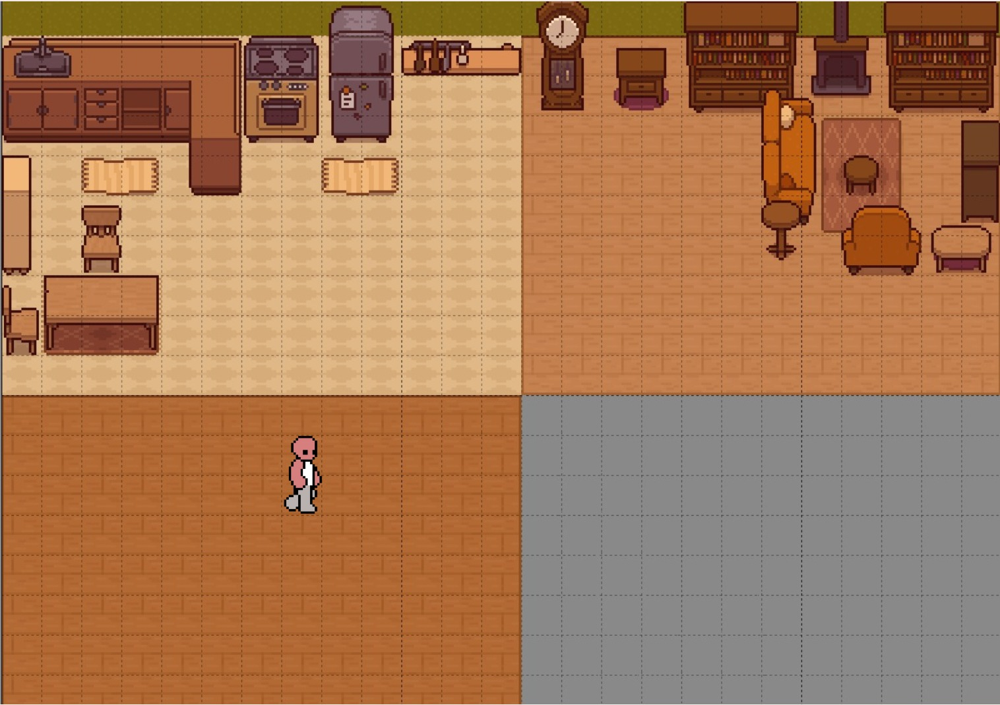

Fonte: AmnesIA, Inteli, 2025.

## Dificuldades Encontradas

- Ajustar o posicionamento do jogador para garantir que ele não ultrapasse os limites da tela.  
- Garantir que a imagem de fundo se adaptasse corretamente a diferentes tamanhos de tela.  

## Próximos Passos

- Incluir colisão entre o personagem e o quarto.  
- Desenvolver a lógica de objetivos e pontuação.  
- implementação da tela de start

Figura 17: Imagem do primeiro código.

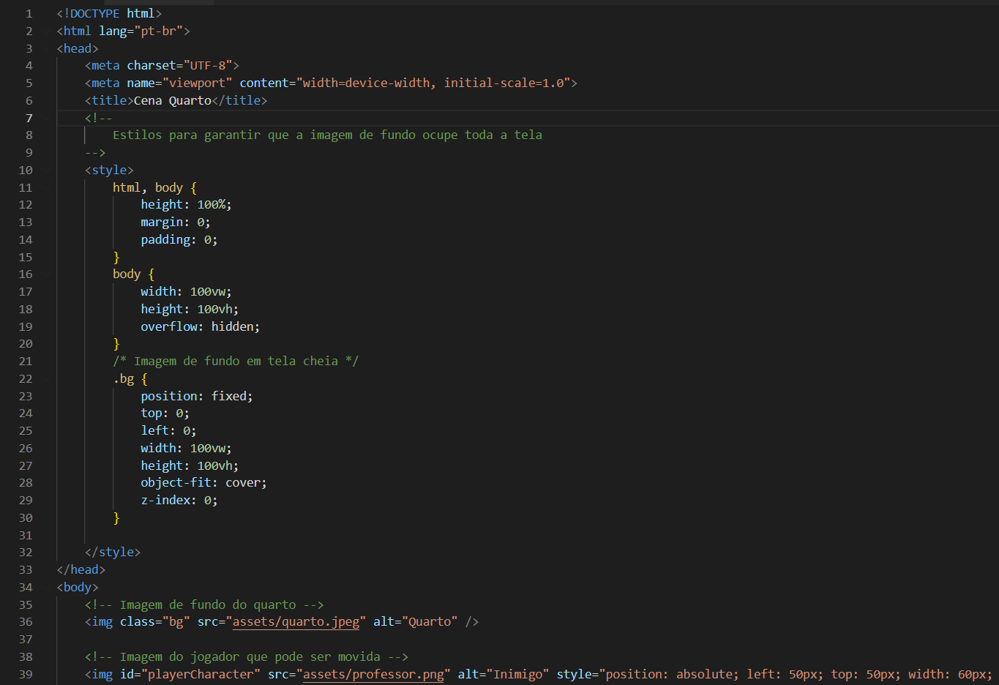

Fonte: AmnesIA, Inteli, 2025.

Figura 18: Imagem do primeiro código.

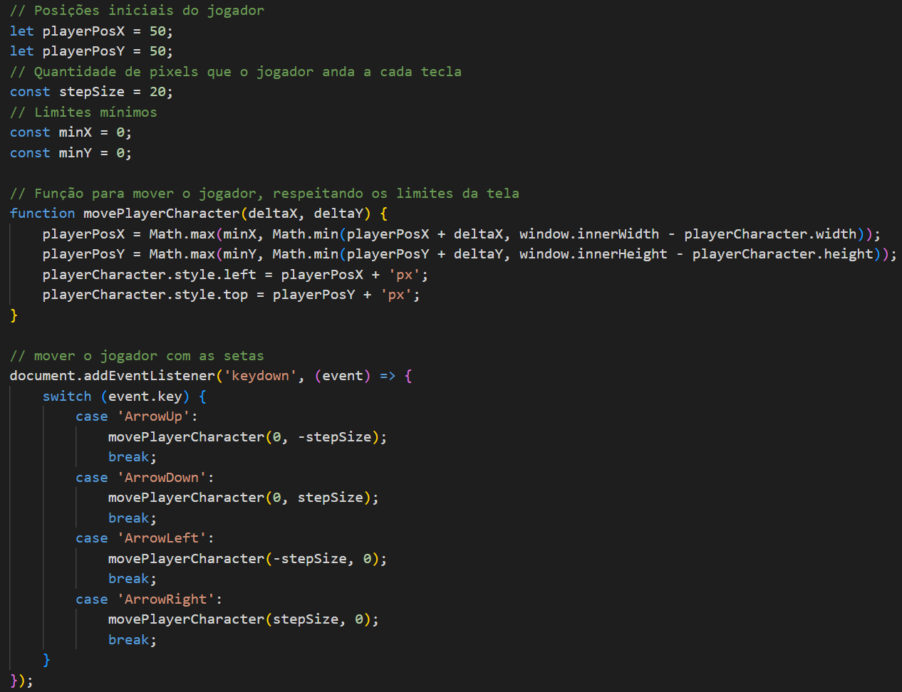

Fonte: AmnesIA, Inteli, 2025.

## Descrição do Código

O código desenvolvido cria a primeira cena do jogo, representando um quarto com a imagem de fundo exibida em tela cheia. Utilizando HTML e CSS, o layout garante que não haja barras de rolagem e que o cenário ocupe toda a área visível do navegador. Sobre esse fundo, é posicionada a imagem de um inimigo, que aparece de forma destacada e pode ser movimentada pelo jogador.

A movimentação do inimigo é controlada por JavaScript, que detecta as teclas direcionais do teclado e altera a posição da imagem de acordo com o comando recebido. O código limita o movimento do inimigo para que ele não ultrapasse as bordas da tela, proporcionando uma experiência visual consistente. Essa estrutura serve como base para futuras funcionalidades, como a inclusão de outros personagens, colisões e objetivos de jogo.


## 4.2. Desenvolvimento básico do jogo 

Antes do desenvolvimento das funcionalidades do jogo, foi organizada a estrutura do projeto, criando-se uma pasta denominada scenes, responsável por armazenar os arquivos JavaScript relacionados às diferentes cenas do jogo. Nessa pasta estão concentrados os scripts que controlam cada etapa da experiência do jogador, como tela inicial, apresentação da história e fases jogáveis. Essa organização permite separar responsabilidades dentro do código, facilitando a manutenção, a navegação entre cenas e a futura expansão do jogo. Cada arquivo.js presente na pasta representa uma cena específica, contribuindo para uma estrutura modular e mais organizada do projeto.

Figura 19: Estrutura de pastas dos arquivos da segunda sprint

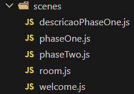

Fonte: AmnesIA, Inteli, 2025.

O arquivo descricaoPhaseOne.js, localizado na pasta scenes, é responsável por apresentar a tela introdutória da primeira fase do jogo. Nessa cena, a imagem fundo.jpg é utilizada para mostrar a progressão das fases, indicando ao jogador em qual etapa do jogo ele se encontra. Em seguida, a imagem fundoJogoUm.jpg representa o cenário do primeiro minigame, permitindo que o jogador jogue a primeira fase. Já a imagem descricao.png funciona como um balão de orientação, exibindo instruções sobre como jogar o minigame. Importante lembrar que foi implementada uma interação nesse balão em que, ao pressionar a tecla E, o jogador avança para a cena PhaseOne, iniciando o primeiro desafio do jogo. Essa cena tem como objetivo orientar o jogador e contextualizar a fase antes do início da jogabilidade.

Figura 20: Código da primeira versão da descrição da fase um.

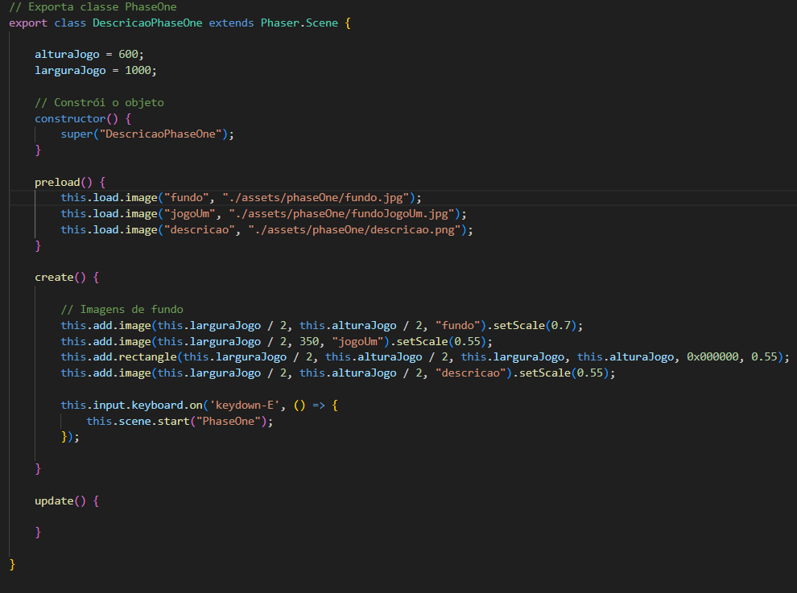

Fonte: AmnesIA, Inteli, 2025.

O arquivo PhaseOne.js, da pasta scenes, é responsável pelo funcionamento do primeiro minigame do jogo. Nessa cena, são carregadas as imagens que compõem o cenário, os cartões interativos e as peças corretas e incorretas que formam o desafio. O jogador deve arrastar os cards até o fio do computador apresentado no minigame, simulando a montagem adequada dos elementos. Quando o card correto é posicionado próximo ao alvo certo, o jogo identifica o acerto automaticamente, altera a imagem para indicar que a conexão está correta e avança para a próxima rodada após um pequeno intervalo de tempo. O sistema foi organizado em rodadas, permitindo que diferentes combinações de respostas sejam apresentadas ao longo da fase, aumentando gradualmente o progresso do jogador. Dessa forma, essa cena implementa a principal mecânica interativa do Minigame 1, baseada em arrastar e soltar elementos para resolver o desafio proposto.

Figura 21: Código da primeira versão da fase um.

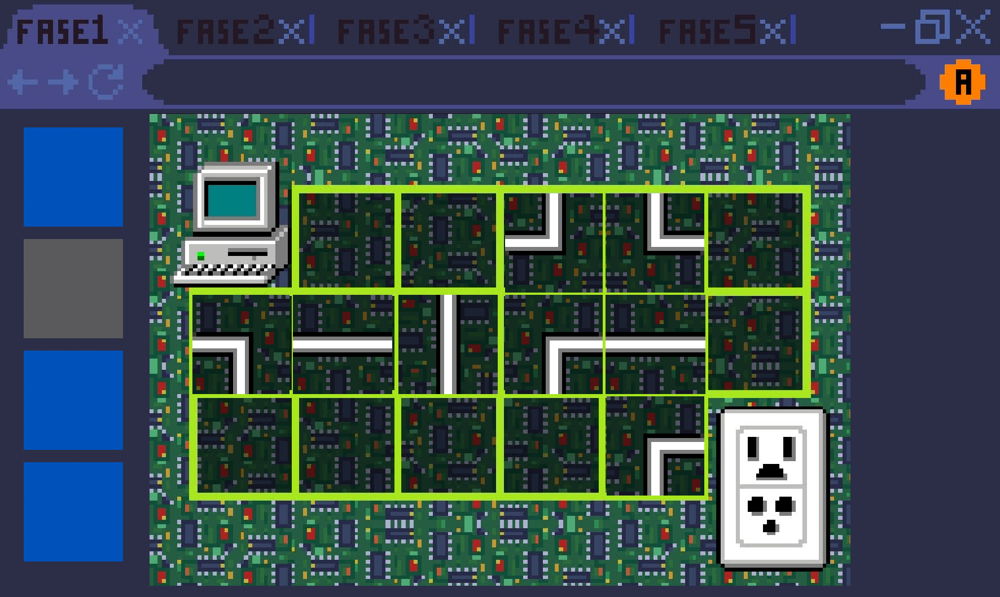

Fonte: AmnesIA, Inteli, 2025.

O arquivo PhaseTwo.js, localizado na pasta scenes, representa a estrutura inicial da segunda fase do jogo. Nessa etapa foi criada a cena PhaseTwo, responsável por preparar o ambiente onde o próximo minigame será desenvolvido. Atualmente, o código realiza o carregamento da imagem fundo.jpg, utilizada como plano de fundo da fase, exibindo o cenário centralizado na tela para manter o padrão visual das fases anteriores. Essa implementação funciona como uma base para o desenvolvimento futuro da fase 2, permitindo que novas mecânicas, interações e desafios sejam adicionados posteriormente. Como próximos passos, pretende-se inserir os elementos jogáveis e a lógica principal do segundo minigame.

Figura 22: Código da primeira versão da fase dois.

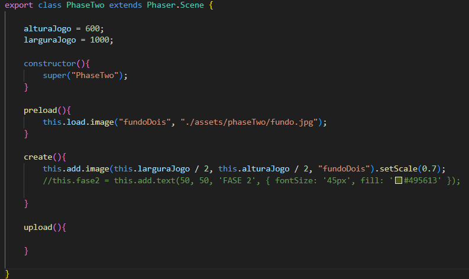

Fonte: AmnesIA, Inteli, 2025.

O arquivo Room.js é responsável por criar a cena do quarto, que funciona como um espaço de exploração antes do jogador iniciar a primeira fase do jogo. Nesse código, é criada a classe Room, que tem as funcionalidades do Phaser para controlar uma nova cena. No preload, são carregadas as imagens do cenário do quarto, do personagem controlável e do ícone da tecla de interação. Já no create, o fundo do quarto é exibido, o personagem é criado utilizando o sistema de física do Phaser e a imagem da tecla E. No método update, o jogador pode se mover usando as setas do teclado, tendo sua posição limitada dentro da área estabelecida. O código ainda calcula a distância entre o personagem e um ponto específico do quarto e, quando o jogador se aproxima, o ícone da tecla aparece na tela indicando que é possível interagir; ao pressionar E, o jogo troca para a cena DescricaoPhaseOne, iniciando a próxima etapa do jogo.

Figura 23: Segunda versão do quarto do personagem.

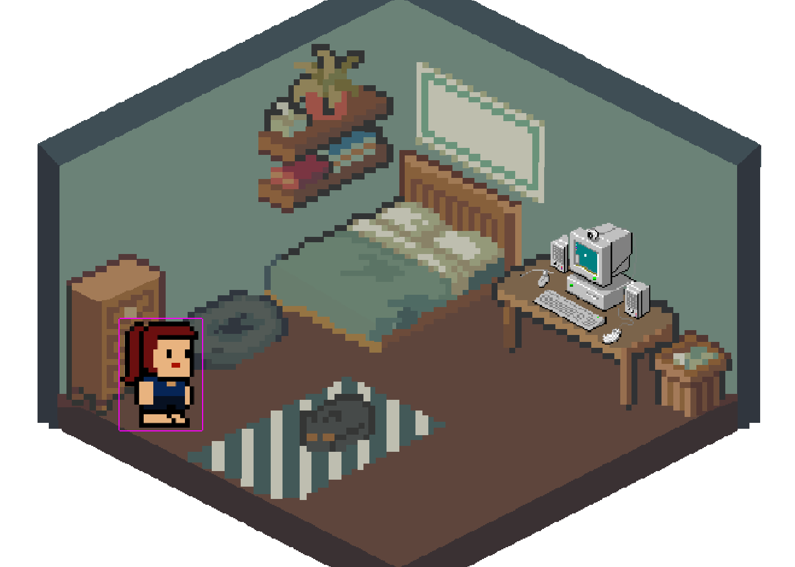

Fonte: AmnesIA, Inteli, 2025.

O arquivo Welcome.js, localizado na pasta scenes, é responsável pela tela inicial do jogo, sendo o primeiro contato do jogador com a aplicação. Nessa cena, é carregada uma imagem de fundo que representa o menu principal e um botão Play, utilizado para iniciar o jogo. O fundo é ajustado automaticamente para se encaixar na tela sem distorcer a imagem, garantindo uma boa adaptação à resolução definida. O botão Play foi configurado como interativo, mudando o cursor do mouse quando o jogador passa sobre ele para indicar que é clicável. Ao clicar no botão, o jogo realiza a transição para a cena Room, dando início à experiência jogável. Essa cena funciona como o menu inicial, permitindo ao jogador começar o jogo de forma simples e intuitiva.

Figura 24: Primeira versão da tela Welcome.

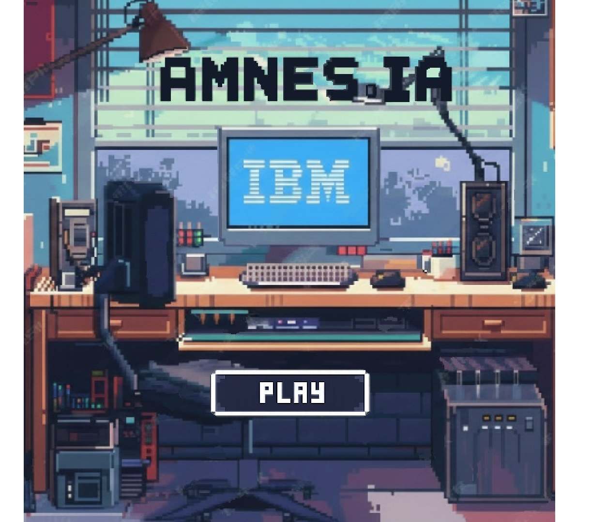

Fonte: AmnesIA, Inteli, 2025.

## 4.3. Desenvolvimento intermediário do jogo 

Na terceira sprint, o desenvolvimento avançou em duas frentes principais: a implementação completa da segunda fase do jogo e melhorias significativas na cena do quarto, com destaque para a animação do personagem, adição da tela de seleção de personagens e o minigame 2.

Figura 25: Primeira versão da tela Seleção de Personagens.

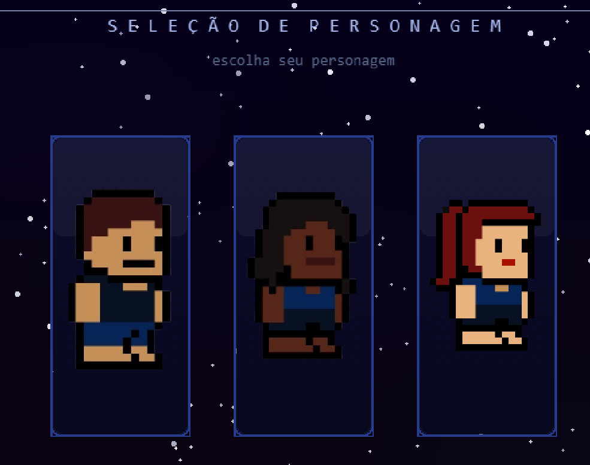

Fonte: AmnesIA, Inteli, 2025.

Foi implementada uma tela de seleção de personagens, permitindo que o jogador escolha entre os três protagonistas disponíveis antes de iniciar a jornada no quarto. Cada personagem possui sua própria representação visual e, ao ser selecionado, é carregado corretamente nas cenas subsequentes do jogo. Essa funcionalidade reforça a proposta de diversidade e representatividade descrita na seção 3.2.1, dando ao jogador autonomia para se identificar com o personagem que melhor o representa.

Figura 27: Sprite sheet da movimentação do personagem.

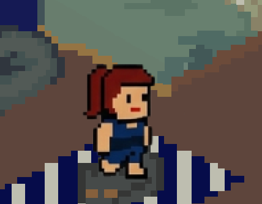

Fonte: AmnesIA, Inteli, 2025.

O personagem controlável passou a contar com animações de movimentação, substituindo a imagem estática utilizada nas sprints anteriores. Foram configurados spritesheets com frames de caminhada para as quatro direções (cima, baixo, esquerda e direita), tornando a movimentação pelo quarto mais fluida e visualmente coerente com a proposta do jogo.

Figura 28: Primeira versão da Fase Dois.

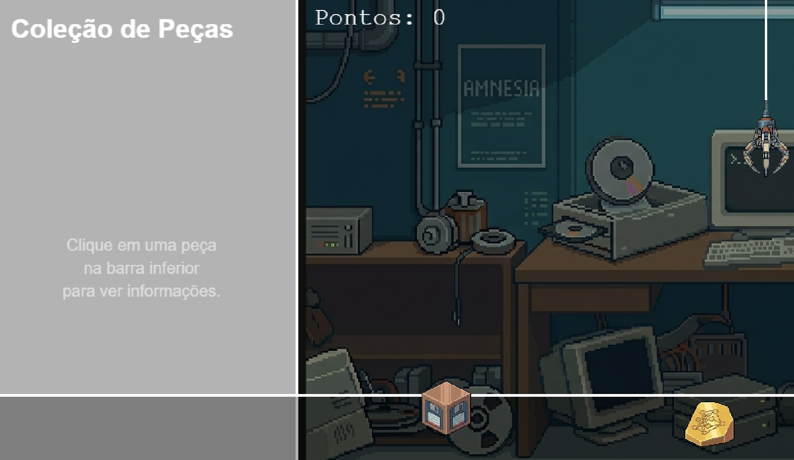

Fonte: AmnesIA, Inteli, 2025.

O  PhaseTwo.js foi expandido com a lógica completa do segundo minigame. A fase apresenta um novo desafio interativo relacionado aos conteúdos de Inteligência Artificial, seguindo a progressão de dificuldade estabelecida nas regras do jogo. Ao concluir corretamente o desafio, o jogador avança para a próxima aba do computador do personagem, dando continuidade à narrativa de reconstrução da memória. com uma garra você coleta pontos para a progredir

### Dificuldades Encontradas

A principal dificuldade desta sprint foi a integração entre cenas, especialmente garantir que o personagem selecionado na tela de escolha fosse transmitido e carregado corretamente nas cenas seguintes, como o quarto e as fases e foram necessários muitos dias para o desing ficar pronto.


## 4.4. Desenvolvimento final do MVP 

A tela inicial representa o primeiro contato do jogador com a aplicação. Nesta cena, é exibida uma imagem de fundo que funciona como menu principal, acompanhada de um botão Play para iniciar o jogo. O fundo é ajustado automaticamente para se adequar à resolução da tela sem distorcer a imagem, garantindo uma boa adaptação visual. O botão Play foi configurado como elemento interativo. Ao clicar no botão, o jogo faz a transição para a cena Quarto, onde a experiência jogável tem início. Essa cena atua como um menu inicial simples e intuitivo, permitindo que o jogador comece o jogo com facilidade.

Figura 29: Versão da tela de início atualizada.

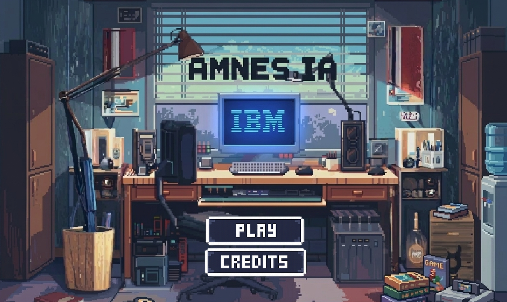

Fonte: AmnesIA, Inteli, 2025.

A tela de seleção de personagens é apresentada após o menu inicial, permitindo que o jogador escolha um entre três avatares disponíveis antes de iniciar a experiência na cena Room. Nesta cena, um fundo temático é carregado e ajustado automaticamente para se adequar à resolução da tela sem distorcer a imagem, mantendo a identidade visual do jogo. Os três personagens são exibidos como botões interativos, cada um acompanhado de uma prévia visual. Ao passar o mouse sobre qualquer uma das opções, o cursor se transforma para indicar a interatividade, e um efeito visual de destaque é aplicado ao avatar selecionado. Após a escolha, um botão de confirmação permite que o jogador prossiga para a fase seguinte. Essa tela oferece uma camada de personalização e engajamento, tornando a experiência mais envolvente desde os momentos iniciais do jogo.

Figura 30: Atualização do design da tela de Seleção de Personagens.

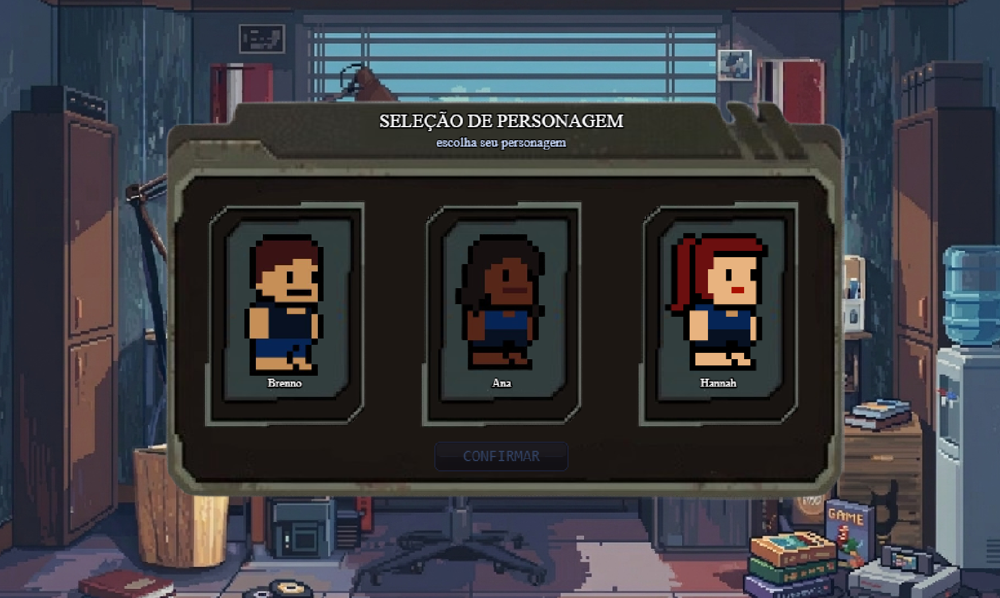

Fonte: AmnesIA, Inteli, 2025.

Durante a experiência no jogo, as cutscenes são integradas diretamente ao ambiente do quarto, criando uma transição fluida entre os momentos narrativos e a jogabilidade. Essas sequências ocorrem dentro do próprio cenário, mantendo o jogador imerso na ambientação sem interrupções bruscas ou telas de carregamento. Assim que a cutscene é concluída, o jogador assume o controle novamente no mesmo ambiente, podendo explorar o quarto e interagir com os elementos disponíveis. Essa abordagem garante que a narrativa e a ação estejam em constante diálogo, tornando a experiência mais coesa e envolvente, sem que o jogador perca a sensação de continuidade dentro do mundo do jogo.

Figura 31: Adição das telas de Cutscene.


Fonte: AmnesIA, Inteli, 2025.

Fase 1 é o primeiro minigame do jogo. Nessa cena, são carregadas as imagens que compõem o cenário, os cartões interativos e as peças corretas e incorretas que formam o desafio. O jogador deve arrastar os cards até o fio do computador apresentado no minigame, simulando a montagem adequada dos elementos. Quando o card correto é posicionado próximo ao alvo certo, o jogo identifica o acerto automaticamente, altera a imagem para indicar que a conexão está correta e avança para a próxima rodada após um pequeno intervalo de tempo. O sistema foi organizado em rodadas, permitindo que diferentes combinações de respostas sejam apresentadas ao longo da fase, aumentando gradualmente o progresso do jogador. Dessa forma, essa cena implementa a principal mecânica interativa do Minigame 1, baseada em arrastar e soltar elementos para resolver o desafio proposto.

Figura 32: Atualização da jogabilidade da Fase Um.

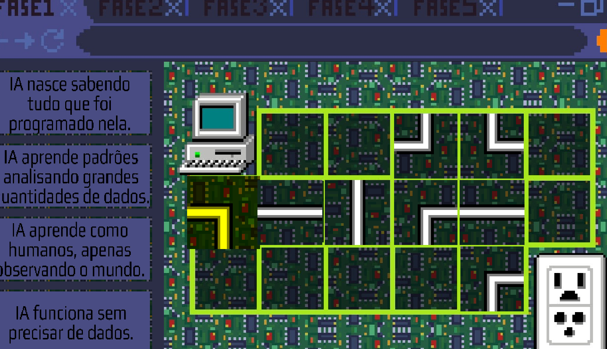

Fonte: AmnesIA, Inteli, 2025.

A Fase 2, implementada no arquivo correspondente da pasta scenes, apresenta uma mecânica diferenciada baseada no controle de uma garra que se move verticalmente. O jogador deve manobrar a garra para cima e para baixo, coletando os itens que surgem na tela. Cada tipo de elemento gera um efeito distinto na pontuação: ao pegar lixo, o jogador perde pontos; ao coletar caixas, pontos são adicionados ao placar; e os itens dourados, mais raros, concedem uma grande quantidade de pontos quando capturados. Além da mecânica de coleta, a fase também oferece um momento de aprendizado, permitindo que o jogador leia um conteúdo informativo relacionado à inteligência artificial, integrando diversão e conhecimento de forma equilibrada. Essa combinação entre habilidade e conteúdo educacional torna a experiência mais dinâmica e envolvente.

Figura 33: Atualização da jogabilidade da Fase Dois.

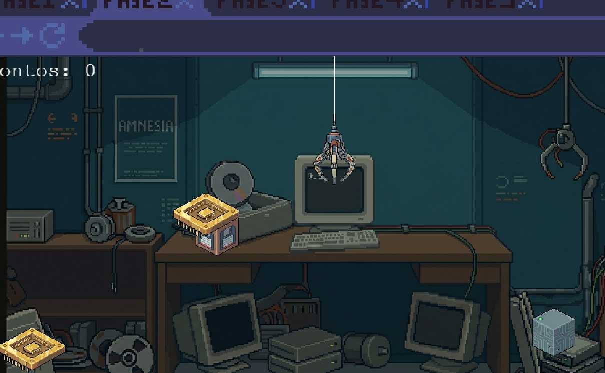

Fonte: AmnesIA, Inteli, 2025.

A Fase 3, presente na pasta scenes, propõe um desafio de associação baseado na conexão de balões por meio de fios. O jogador controla um robô que se move pela tela para realizar as conexões. Na parte esquerda do cenário, são exibidas descrições sobre diferentes inteligências artificiais, enquanto o lado direito apresenta os nomes ou conceitos correspondentes, organizados em balões interativos. O objetivo é ligar os oito balões, formando quatro pares corretos entre cada descrição e sua respectiva IA. Para auxiliar na tomada de decisão, quando o robô se aproxima de qualquer balão, o conteúdo referente a ele é exibido, permitindo que o jogador consulte as informações antes de realizar a conexão. Essa mecânica incentiva a leitura atenta e o raciocínio lógico, tornando a fase uma experiência educativa e interativa, na qual o aprendizado sobre inteligência artificial ocorre de forma lúdica e envolvente.

Figura 34: Adição da Fase Três.

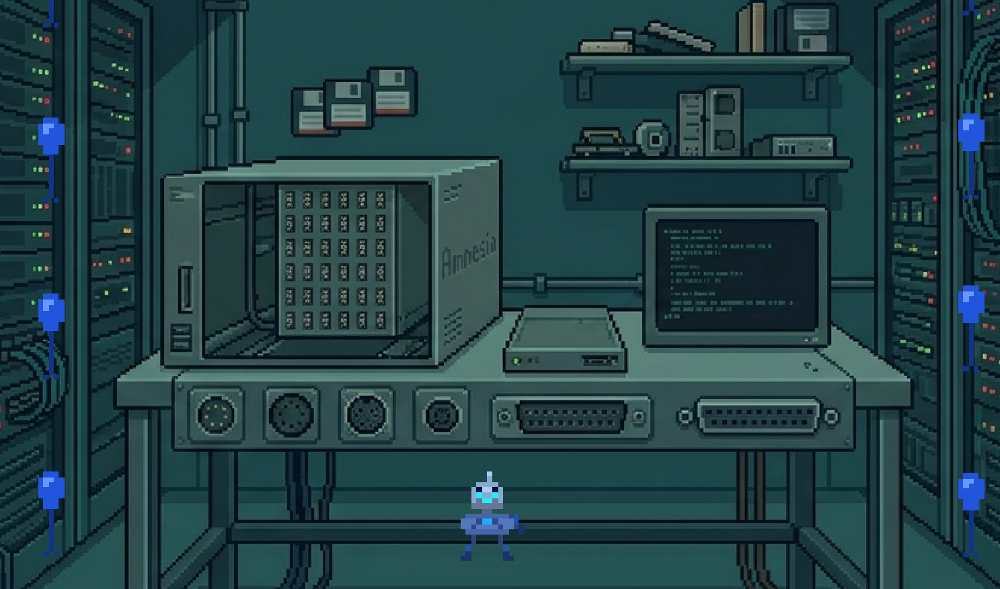

Fonte: AmnesIA, Inteli, 2025.

A Fase 4 representa a batalha final do jogo, sendo a última tela da experiência. Nesta fase, o jogador controla um robô que voa e atira, enfrentando um chefe (boss) que também se desloca pelo ar e revida com seus próprios projéteis. O diferencial dessa luta está na integração de perguntas sobre inteligência artificial ao longo do confronto. Quando uma pergunta aparece na tela, o jogador deve respondê-la corretamente para obter vantagem: ao acertar, seu robô causa mais dano ao inimigo e aumenta sua velocidade de disparo; ao errar, o boss se fortalece, passando a causar mais dano e atirar de forma muito mais rápida. O objetivo central é reduzir a vida do chefe a zero antes que ele esgote a barra de vida do jogador, combinando habilidade nos controles com conhecimento sobre o conteúdo abordado ao longo do jogo. Essa mecânica cria um desafio dinâmico e recompensador, culminando a jornada de forma tensa e educativa.

Figura 35: Adição da Fase Quatro.

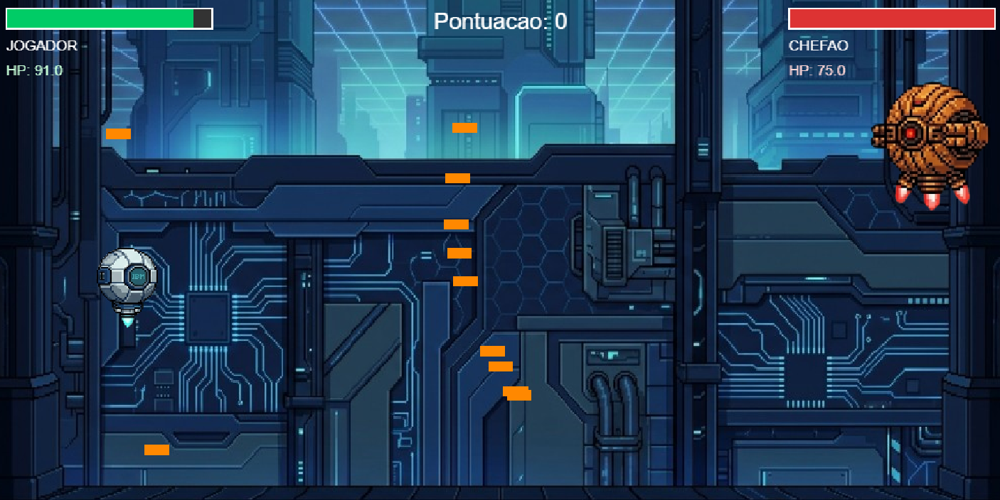

Fonte: AmnesIA, Inteli, 2025.

O jogo conta com uma mecânica especial de progressão que recompensa o jogador a cada fase concluída. Ao final de cada uma das quatro etapas, é desbloqueado um papel correspondente que compõe um quadro de aprendizagem. Cada papel contém o conteúdo trabalhado na respectiva fase, apresentando de forma resumida e visual o que o jogador aprendeu sobre inteligência artificial ao longo daquele desafio. À medida que as fases são concluídas, o quadro vai sendo preenchido gradualmente, permitindo que o jogador visualize seu progresso e revise os conhecimentos adquiridos. Essa mecânica incentiva a conclusão de todas as etapas e reforça o caráter educativo do jogo, transformando a experiência em uma jornada de aprendizado contínuo e recompensador.

Figura 36: Adição da tela do Quadro de Aprendizagem.

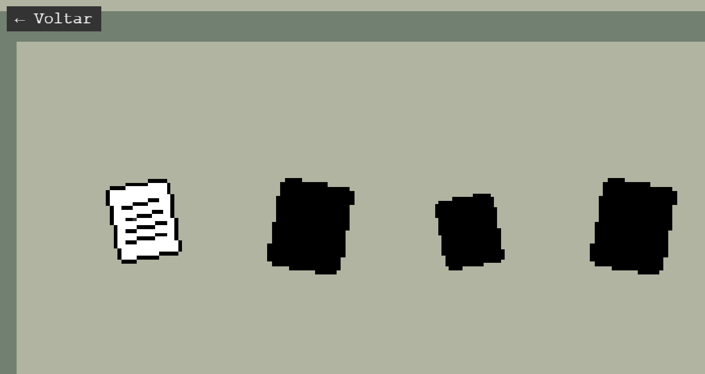

Fonte: AmnesIA, Inteli, 2025.


## 4.5. Revisão do MVP 

O refinamento do jogo foi feito com base nos feedbacks obtidos no playtest. Realizamos melhorias e alterações nas telas de tutorial, trilha sonora, dificuldade na tela final, fluidez entre as fases e atualização dos conteúdos apresentados. Foram adicionadas cutscenes para contextualização e desfecho do enredo, encerrando a narrativa de forma natural.

Figura 37: Adição das telas de Cutscene Final.

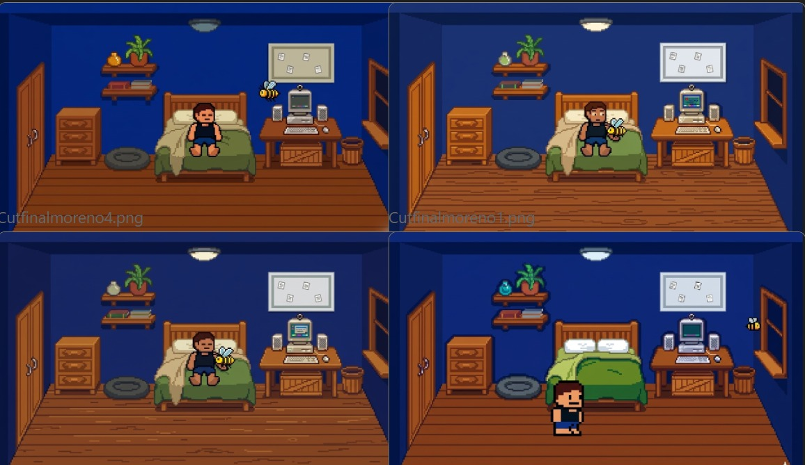

Fonte: AmnesIA, Inteli, 2025.

Foram implementadas e alteradas as identidades visuais das telas de finalização das fases, assim como pequenos elementos que indicam ações para fechar tela.

Figura 38: Melhoria de design e ações na Fase Dois.

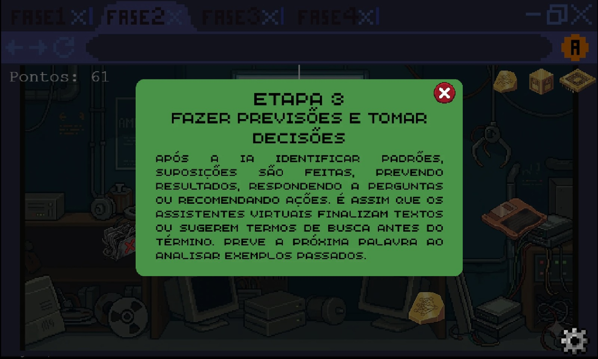

Fonte: AmnesIA, Inteli, 2025.

Figura 39: Adição de telas de Conclusão de Fases.

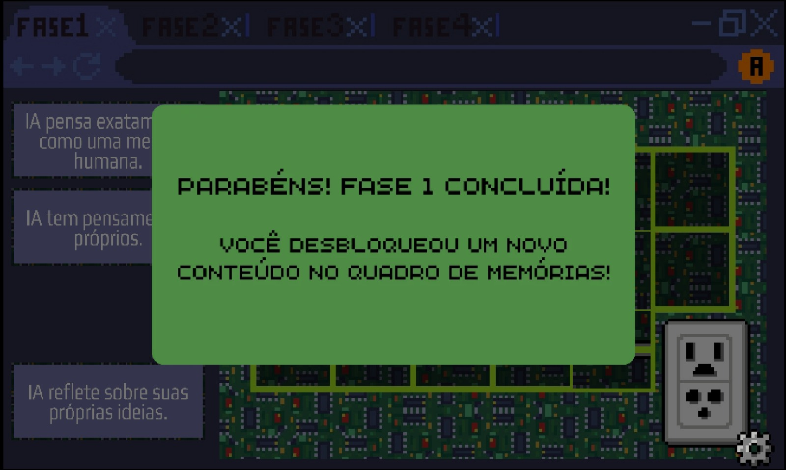

Fonte: AmnesIA, Inteli, 2025.

Foram feitas alterações nos disparos respectivos a última fase, tanto do "chefão" quando do personagem.

Figura 40: Adição da sprite sheet dos disparos da Fase Quatro.

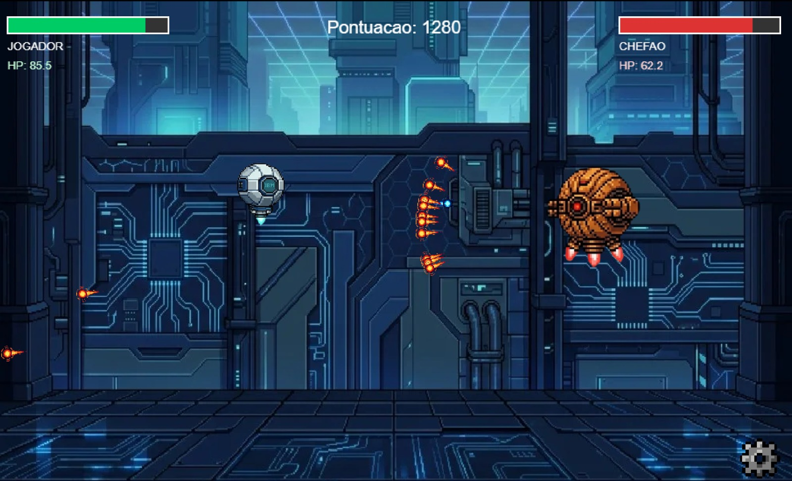

Fonte: AmnesIA, Inteli, 2025.

# <a name="c5"></a>5. Testes

Figura 41: Adição da tela de Configurações.

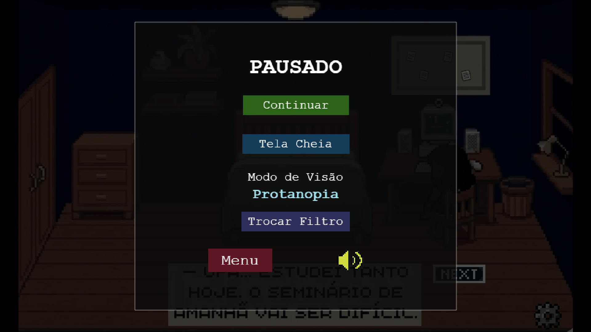

Acessibilidade
Em nosso jogo, foi implementado um modo daltônico pensado especialmente para pessoas com daltonismo, permitindo uma melhor distinção de cores e elementos visuais durante a jogabilidade. Essa funcionalidade foi desenvolvida como parte do nosso compromisso com a inclusão e a acessibilidade, garantindo que mais jogadores possam aproveitar a experiência de forma confortável e justa. Acreditamos que jogos devem ser acessíveis para todos, independentemente de suas limitações visuais, e por isso buscamos adaptar nossos recursos para atender diferentes necessidades.


## 5.1. Casos de Teste 

Para que jogos eletrônicos alcancem os níveis de qualidade esperados, os casos de teste são essenciais, pois permitem identificar falhas, verificar funcionalidades e analisar o desempenho do jogo de forma sistemática e eficiente. Além disso, garantem consistência ao tornar o processo de teste repetível, independentemente de quem o execute, aumentam a eficiência ao orientar verificações claras e objetivas, asseguram a reprodutibilidade dos erros para facilitar sua correção e ainda servem como documentação detalhada, contribuindo para uma comunicação mais eficaz entre testadores e desenvolvedores. (TESTERS HUB, 2023)

| # | Pré-condição | Descrição do teste | Pós-condição |
|---|--------------|-------------------|--------------|
| 1 | Abrir o link do jogo | Clicar no botão “Play” | O jogo deve iniciar a tela de seleção dos personagens |
| 2 | Abrir o link do jogo | Clicar no botão “Credits” | O jogo deve iniciar a tela de créditos |
| 3 | Estar na tela de créditos | Clicar no botão “Back” | O jogo deve iniciar a tela inicial do jogo |
| 4 | Estar na tela de seleção de personagens | Clicar em algum personagem | Botão fica em evidência |
| 5 | Ter escolhido algum personagem | Clicar no botão confirmar | O jogo deve iniciar a tela da cutscene com o personagem escolhido |
| 6 | Estar na tela de cutscene com o personagem escolhido | Clicar no botão Next | Card da história segue sua sequência |
| 7 | Estar na quinta vez que apertou o botão | Clicar no botão Next pela sexta vez | O jogo deve iniciar a tela do quarto |
| 8 | Posicionar o personagem em local determinado | Utilizar "W-A-S-D" para movimentação | Personagem deve se mover de acordo com as teclas indicadas |
| 9 | Estar na tela do quarto | Mover o personagem até o computador | Aparecer tecla *E* |
| 10 | Tecla *E* visível | Clicar na tecla *E* | Inicializar a tela de tutorial da fase um |
| 11 | Estar na tela de tutorial | Clicar na tecla *E* | Inicializar a tela da fase um |
| 12 | Estar na tela do mini puzzle da fase um | Mover o card certo até o circuito | Imagem do circuito fica verde e na direção certa | 
| 13 | Estar na tela do mini puzzle da fase um | Mover o card errado até o circuito | Imagem do circuito permanece igual e o card volta para o local original |
| 14 | Último card para mover | Mover o card certo para a última imagem do circuito | Inicializar tela de conclusão de fase |
| 15 | Estar na tela de conclusão de fase | Clicar no card com o cursor do mouse | O jogo deve iniciar a tela do quarto | 
| 16 | Estar na tela do quarto | Apertar a tecla "Q" | O jogo deve iniciar a tela do quadro de memórias | 
| 17 | Estar na tela do quadro de memórias | Clicar na folha | Tela da folha de conceitos basicos da primeira fase | 
| 18 | Clicar na tela com o mouse | Volta r para a tela do quadro | clicar no botão "Voltar" no canto superior esquerdo |
| 19 | Estar de volta a tela do quarto | Direcionar o boneco para o computador | Apertar a tecla "E" | 
| 20 | Estar na tela de instrução da segunda fase | Apertar a tecla *E* | O jogo deve iniciar a tela do puzzle da segunda fase |
| 21 | Estar na tela do puzzle da segunda fase | Apertar a tecla "S" para baixo | Garra mecânica deve descer |
| 22 | Estar na tela do puzzle da segunda fase | Apertar a tecla "W" para cima | Garra mecânica deve subir |
| 23 | Estar na tela do puzzle da segunda fase | Encostar no lixo eletrônico | Tela de *Game Over* aparece |
| 24 | Estar na tela de Game Over | Apertar a tecla *Esc* | O jogo deve iniciar a tela do jogo novamente |
| 25 | Estar na tela do puzzle da segunda fase | Encostar nos cubos normais | Adiciona pontos |
| 26 | Estar na tela do puzzle da segunda fase | Encostar nos objetos dourados | Adiciona pontos e o objeto deve se mover para baixo | 
| 27 | Estar com um objeto na seção de cima | Clicar no objeto | Um conceito sobre IA aparece na tela |
| 28 | Estar próximo de atingir 100 pontos | Encostar em um elemento | Atinge 100 pontos e mostra mensagem de *“Você venceu”* |
| 29 | Ter atingido 100 pontos e ver a mensagem “Você venceu” | Apertar a tecla "Esc" para pausar e despausar | O jogo deve iniciar a tela do jogo novamente |
| 30 | Vencer o jogo | Voltar para a tela do quarto | apertar a tela "Q" | 
| 31 | Abrir a tela do quadro de memórias | Clicar com o mouse na segunda folha | Clicar com o mouse na tela |
| 32 | Clicar no botão de "Voltar" no canto superior esquerdo | Voltar a tela do quarto | Clicar a tecla "E" |
| 33 | Tela de tutorial da fase 3 | Clicar tecla "E" para iniciar a fase | Tela da fase 3 | 
| 34 | Encostar no balão para ver as informações | clicar na tecla *Espaço* para pegar o fio | Direcionar o robo para o balão do lado oposto | 
| 35 | Clicar na tecla *Espaço* para soltar o fio no balão certo | Mover o robo para outro balão | Repetir os mesmos movimentos | 
| 36 | Tela de parabens ao completar o mini game | Clicar no botão "Voltar ao quarto" | Tela do quarto | 
| 37 | Mover o personagem até o computador | Apertar a tecla "Q" | Tela do quadro de memórias | 
| 38 | Clicar na terceira folha | Tela de informação sobre a fase 3 | Clicar com o mouse no botão "Voltar" no canto superior esquerdo | 
| 39 | Tela do quarto | Apertar a tecla "E" | Video de transição | 
| 40 | Tela de tutorial da fase 4 | Apertar tecla "E" para iniciar | Tela da fase 4 |
| 41 | Movimentar no "W-S" para cima e para baixo | Movimentar na tecla "A-D" para frente e para atras | Atirar clicando ou segurando na tecla "Espaço" |  
| 42 | Estar na tela da fase 4 | Aparecer pergunta | Clicar com o mouse na resposta |   
| 43 | Acertar a pergunta | Melhorar o robô | Atirar contra o Boss | 
| 44 | Errar a pergunta | Melhorar o Boss | Concluir a fase | 
| 45 | Voltar para a tela de inicio | 


## 5.2. Testes de jogabilidade (playtests) 

### 5.2.1 Registros de testes

Nome  |  Rafael
--- | ---
Já possuía experiência prévia com games? | Sim 
Conseguiu iniciar o jogo? | Sim 
Entendeu as regras e mecânicas do jogo? | Mecânica da fase 3 
Conseguiu progredir no jogo? | Travou na fase 3, por não entender a mecânica.
Apresentou dificuldades? | Dificuldades com conceitos iniciais (primeira fase)
Que nota deu ao jogo? | 8, porque não entendeu muito a fase 3 e achou a fase 4 do chefão meio difícil
O que poderia melhorar no jogo? | Poderia ter dicas, caso não consiga progredir.


Nome  |  Clara
--- | ---
Já possuía experiência prévia com games? | Sim mas não joga com frequência.
Conseguiu iniciar o jogo? | Sim
Entendeu as regras e mecânicas do jogo? | Dificuldade em entender os controles da fase 3 e 4
Conseguiu progredir no jogo? | Sim, mas demorou um pouco para entender
Apresentou dificuldades? | Em controles e parte do conteúdo
Que nota deu ao jogo? | 9,5 jogaria novamente
O que poderia melhorar no jogo? | fase 3 deixar mais intuitivo


Nome  |  Raissa
--- | ---
Já possuía experiência prévia com games? | Não 
Conseguiu iniciar o jogo? | Sim 
Entendeu as regras e mecânicas do jogo? | dificuldade em entender a mecanica da fase 2 e 3 e controles da fase 3
Conseguiu progredir no jogo? | Sim mas com dificuldade
Apresentou dificuldades? | Sim com os controles da fase 2 e 3
Que nota deu ao jogo? | 8 gostou mas deixar mais explicativo
O que poderia melhorar no jogo? | Deixar mais intuitivo e explicativo 


Nome  |  Felipe 
--- | ---
Já possuía experiência prévia com games? | Sim
Conseguiu iniciar o jogo? | Sim
Entendeu as regras e mecânicas do jogo? | Não 
Conseguiu progredir no jogo? | Sim
Apresentou dificuldades? | Sim 
Que nota deu ao jogo? | 7
O que poderia melhorar no jogo? | Inverter a relação de desbloqueio de nota e fase


Nome  |  Victoria
--- | ---
Já possuía experiência prévia com games? | Sim
Conseguiu iniciar o jogo? | Sim 
Entendeu as regras e mecânicas do jogo? | Sim 
Conseguiu progredir no jogo? | Sim 
Apresentou dificuldades? | Sim 
Que nota deu ao jogo? | 8
O que poderia melhorar no jogo? | Explicar a "parte social" da ia, tutorial na fase 4


Nome  |  Álvaro
--- | ---
Já possuía experiência prévia com games? | Sim 
Conseguiu iniciar o jogo? | Sim 
Entendeu as regras e mecânicas do jogo? | Sim
Conseguiu progredir no jogo? | Sim
Apresentou dificuldades? | Sim
Que nota deu ao jogo? | 9
O que poderia melhorar no jogo? | Ter mais tutoriais 


Nome  |  Pablo
--- | ---
Já possuía experiência prévia com games? | Sim, era bastante experiente 
Conseguiu iniciar o jogo? | Sim
Entendeu as regras e mecânicas do jogo? | Sim, exceto na compreensão das mecânicas da fase 1 e como reiniciar a fase 2
Conseguiu progredir no jogo? | Travou na fase 1, por não entender as mecânicas
Apresentou dificuldades? | Somente em relação à mecânicas, já com conteúdos não teve nenhuma dificuldade
Que nota deu ao jogo? | 9, a ideia foi ótima, somente alterar a explicação das mecânicas 
O que poderia melhorar no jogo? | Para uma pessoa sem conhecimentos de games, a última fase poderia ser difícil, então seria bom colocar tipo um tutorial para ajudar iniciantes. Na fase do peixe, quando o jogador perdesse poderia voltar para a tela de instrução da fase


Nome  |  Victor Lucena 
--- | ---
Já possuía experiência prévia com games? | Sim 
Conseguiu iniciar o jogo? | Sim 
Entendeu as regras e mecânicas do jogo? | Todas, porém demorou um pouco para entender 
Conseguiu progredir no jogo? | Perfeitamente, deve nenhum percalço para a progressão
Apresentou dificuldades? | Entendimento das mecânicas
Que nota deu ao jogo? | 9
O que poderia melhorar no jogo? | Fase 3 quando errar, soltar os fios antes conectados 

### 5.2.1.2 Registros dos testes com público-alvo (Parte 2)

Os testes com público-alvo foram realizados de forma remota, com acesso ao jogo via link e preenchimento de formulário online. Os testadores correspondem ao perfil definido na seção 1.3: jovens universitários entre 18 e 25 anos com interesse em tecnologia.

**Testador 1**

| Nome | João Augusto |
|---|---|
| Apresentação e Termo de Concordância | Concordou com os termos de participação |
| Perfil e Comportamento de Jogo | Jogador casual, joga de 1 a 3 vezes por semana, principalmente no celular |
| Curso | Engenharia de Computação |
| Familiaridade com IA | Sabe usar, mas nunca estudou formalmente |
|  Avaliação do Jogo |  9.0 |
| Conseguiu iniciar e progredir? | Sim, sem dificuldades |
| Entendeu as regras e mecânicas? | Entendeu as essenciais; não explorou comandos complexos como o dash |
| Avaliação das Regras, Objetivos e Controles | Achou os objetivos claros |
| Observações | Gostou da progressão de dificuldade; sugeriu melhorar a responsividade do personagem |  
<br>

**Testador 2**

| Nome | Marina Souza |
|---|---|
| Apresentação e Termo de Concordância | Concordou com os termos de participação |
| Perfil e Comportamento de Jogo | Jogadora frequente de mobile e PC; joga quase todos os dias |
| Curso | Sistemas de Informação |
| Familiaridade com IA | Já estudou o básico em disciplinas da faculdade |
| Avaliação do Jogo | 8.5 |
| Conseguiu iniciar e progredir? | Sim, completou até a Fase 3 |
| Entendeu as regras e mecânicas? | Fase 1 intuitiva; Fase 3 exigiu segunda tentativa para entender o uso da tecla Espaço |
| Avaliação das Regras, Objetivos e Controles | Ficou parada no quarto por 30 segundos sem perceber o ícone da tecla E |
| Observações | Narrativa muito boa; sugeriu ícone de interação maior ou com texto auxiliar |
<br>

**Testador 3**

| Nome | Rafael Lima |
|---|---|
| Apresentação e Termo de Concordância | Concordou com os termos de participação |
| Perfil e Comportamento de Jogo | Quase nenhuma experiência com jogos digitais; joga raramente |
| Curso | Administração |
| Familiaridade com IA | Nunca estudou; tem curiosidade pelo tema |
| Avaliação do Jogo | 7.5 |
| Conseguiu iniciar e progredir? | Completou a Fase 1; tentou a Fase 2 duas vezes sem concluir |
| Entendeu as regras e mecânicas? | Parcialmente, não percebeu que os itens dourados eram especiais na Fase 2 |
| Avaliação das Regras, Objetivos e Controles | Objetivos pouco explicados antes de cada fase; não descobriu a tecla Esc para reiniciar |
| Observações | Valorizou o conteúdo educativo; pediu tutorial mais claro e diferenciação visual dos itens dourados |
<br>

**Testador 4**

| Nome | Camila Ferreira |
|---|---|
|  Apresentação e Termo de Concordância | Concordou com os termos de participação |
| Perfil e Comportamento de Jogo | Jogadora experiente — RPGs e puzzles; joga diariamente |
| Curso | Design |
| Familiaridade com IA | Conhecimento intermediário; usa ferramentas de IA generativa |
| Avaliação do Jogo | 9.5 |
| Conseguiu iniciar e progredir? | Sim, completou o jogo inteiro |
| Entendeu as regras e mecânicas? | Sim, todas — descobriu o dash por conta própria e usou estrategicamente |
|  Avaliação das Regras, Objetivos e Controles | Tentou clicar nos balões com o mouse na Fase 3 antes de entender a mecânica do robô |
|  Observações | Elogiou a variedade de mecânicas; sugeriu mais variações de ataque no boss antes dos limiares de HP |
<br>

**Testador 5**

| Nome | Lucas D'Angelo |
|---|---|
|  Apresentação e Termo de Concordância | Concordou com os termos de participação |
| Perfil e Comportamento de Jogo | Joga jogos de estratégia; pouca experiência com jogos de ação |
| Curso | Ciência da Computação |
| Familiaridade com IA | Estudando o tema no curso atualmente |
|  Avaliação do Jogo | 8.0 |
| Conseguiu iniciar e progredir? | Completou fases 1, 2 e 3; tentou a Fase 4 três vezes sem vencer |
| Entendeu as regras e mecânicas? | Bem nas fases de puzzle; dificuldade nos controles de tiro da Fase 4 |
| Avaliação das Regras, Objetivos e Controles | Não sabia que errar perguntas fortalecia o boss — sentiu a dificuldade aumenta sem entender o motivo |
| Observações | Adorou o quadro de memórias; pediu tutorial antes do boss e opção de dificuldade ajustável |
<br>

### 5.2.1.3 Análise das respostas e principais conclusões

Testes de jogabilidade são sessões onde pessoas reais jogam o jogo e dão feedback. Com eles conseguimos identificar o que está funcionando bem, o que está confuso e o que precisa melhorar antes da entrega final.

Fizemos dois tipos de teste: guerrilha (presencial, com colegas, observando a reação em tempo real) e com público-alvo (remoto, via link, com formulário estruturado). Os testadores são universitários de diferentes cursos, com diferentes níveis de experiência com jogos — exatamente o perfil que definimos na seção 1.3.


Os testes de guerrilha foram feitos no campus do Inteli na Semana 9. Os testes com público-alvo foram remotos, cada um no próprio dispositivo, em horários combinados com a equipe. Participaram João Augusto, Marina Souza, Rafael Lima, Camila Ferreira e Lucas Mendes, estudantes de Engenharia de Computação, Sistemas de Informação, Administração, Design e Ciência da Computação.

**O que os testes mostraram?**

O maior problema foi a interação com o computador no quarto — 3 dos 5 testadores travaram nesse ponto por não perceber o ícone da tecla E. A Fase 3 também gerou confusão: alguns tentaram clicar nos balões com o mouse em vez de mover o robô. No boss, nenhum testador percebeu sozinho que errar perguntas fortalecia o inimigo.

Do lado positivo, a narrativa agradou a todos. A história do personagem com amnésia por estresse foi um ponto forte de identificação, e o quadro de memórias entre fases foi elogiado. A nota média foi **8,5**.

### 5.2.2 Melhorias

Com base nos resultados dos testes, identificamos quatro pontos de melhoria principais:

**1. Indicação de interação com o computador** *(3 de 5 testadores afetados)*

O ícone da tecla E passou despercebido na primeira aproximação. A melhoria é aumentar o ícone, adicionar o texto "Pressione E para interagir" e fazê-lo piscar por 2 segundos na primeira vez que o jogador se aproximar.

**2. Tutorial contextual por fase** *(4 de 5 testadores afetados)*

A melhoria é replicar o padrão da `DescricaoPhaseOne` para as fases 2, 3 e 4, com telas curtas explicando no máximo 3 ações antes de cada minigame. Para a Fase 4, a tela deve explicar o dash, o disparo e o sistema de perguntas que impacta o boss.

**3. Diferenciação visual dos itens dourados na Fase 2** *(2 de 5 testadores afetados)*

Jogadores menos experientes não reconheceram os itens dourados como especiais. A melhoria é dar um efeito de brilho desses itens e exibir o texto "Item especial!" na primeira vez que um aparecer na tela.

**4. Clareza do sistema de perguntas no boss** *(2 de 5 testadores afetados)*

Nenhum testador percebeu sozinho que errar fortalecia o boss. A melhoria é adicionar feedback visual explícito no momento do erro — o boss piscando em vermelho e crescendo levemente — e incluir na tela de instrução da Fase 4: "Responda corretamente para causar mais dano. Errar fortalece o inimigo."

# <a name="c6"></a>6. Conclusões e trabalhos futuros (sprint 5)

O jogo desenvolvido atingiu com êxito os objetivos propostos na seção 1 deste documento: apresentar de forma lúdica e acessível os conceitos fundamentais de Inteligência Artificial e promover o engajamento de universitários com os conteúdos introdutórios disponibilizados pela plataforma IBM SkillsBuild, combatendo o baixo engajamento característico de métodos de ensino tradicionais e passivos.

A narrativa do estudante universitário que sofre amnésia por estresse acadêmico crioa uma conexão emocional genuína com o público-alvo, tornando o aprendizado mais leve e significativo. Aliada a uma progressão de minigames com mecânicas diversificadas por fase, puzzle de cards, garra mecânica, conexão de fios e combate com boss, a experiência se mostrou envolvente e pedagogicamente coerente, integrando conteúdo e jogabilidade de forma orgânica.

**Pontos fortes:**
* Narrativa original e empática, ancorada na realidade do público universitário brasileiro;
* Variedade de mecânicas por fase, evitando a repetitividade e mantendo o engajamento ao longo da jornada;
* Quadro de memórias entre fases, que permite ao jogador revisar os conceitos aprendidos sem interromper o fluxo do jogo;
* Representatividade dos personagens jogáveis, com diversidade étnico-racial e de gênero alinhada aos valores de inclusão do projeto;
* Boss final com significado pedagógico, utilizando a metáfora da IA corrompida para reforçar a importância da qualidade dos dados.

Durante os testes, alguns pontos de melhoria foram identificados:
* Reduzir o atraso percebido entre o comando do jogador e a resposta do personagem, melhorando a fluidez e a sensação de controle, especialmente na navegação pelo quarto;
* Implementar um tutorial interativo no boss, com dicas visuais contextuais (como o ícone da tecla E próximo ao computador), tornando os controles mais intuitivos para jogadores sem familiaridade com o estilo do jogo;
* Padronizar o design visual e sonoro do jogo, garantindo que o jogador compreenda toda a estetica do jogo.

## 6.1. Possibilidades de expansão

O grupo identificou diversas oportunidades para ampliar e aprofundar a experiência do AMNES.IA em desenvolvimentos futuros. A estrutura modular do jogo, organizada em fases independentes acessadas pelas abas do computador, permite a adição de novos conteúdos sem a necessidade de reestruturar o produto, tornando a plataforma escalável. Entre as possibilidades mapeadas estão:

* Novas fases cobrindo tópicos avançados da IBM SkillsBuild, como ética em IA, viés algorítmico e aprendizado por reforço;
* Sistema de pontuação com medalhas por fase e ranking opcional entre jogadores, aumentando o fator de reengajamento;
* Integração direta com a plataforma IBM SkillsBuild, com progresso sincronizado aos módulos dos cursos e certificados desbloqueáveis ao concluir determinadas fases;
* Versão mobile com controles adaptados para toque, ampliando o acesso para universitários que utilizam smartphones como dispositivo principal;
* Implementação de analytics in-game para monitorar tempo por fase, taxa de erro e pontos de abandono, permitindo iterações contínuas baseadas em dados reais.

Essas melhorias e expansões tornam o AMNES.IA não apenas uma solução pontual de introdução à IA, mas um recurso contínuo de aprendizado gamificado com potencial de crescimento dentro do ecossistema IBM SkillsBuild.

# <a name="c7"></a>7. Referências 

ATHENA PRODUCTIONS. What is Concept Art? The Essential Guide. ArtStation. Disponível em: https://www.artstation.com/blogs/athenaproductions8/0vP8B/what-is-concept-art-the-essential-guide. Acesso em: 10 mar. 2026. <br>

ECON MARKET RESEARCH. Gamification in Education Market Size and Trends 2035. Econ Market Research, fev. 2026. Disponível em: https://www.econmarketresearch.com/industry-report/gamification-in-education-market.   Acesso em: 27 fev. 2026 <br>

FORBES. Como brasileiros de diferentes gerações interagem com jogos digitais. Forbes Brasil, 2025. Disponível em: https://forbes.com.br/forbes-tech/2025/04/como-brasileiros-de-diferentes-geracoes-interagem-com-jogos-digitais/. Acesso em: 27 fev. 2026. <br>

Guia do Estudante. Estudo da Unesco mostra que mulheres são minoria nas ciências. Coluna Por Dentro das Profissões, [s. d.]. Disponível em: https://guiadoestudante.abril.com.br/coluna/pordentrodasprofissoes/estudo-da-unesco-mostra-que-mulheres-sao-minoria-nas-ciencias/. Acesso em: 27 fev. 2026. <br>

GRAND VIEW RESEARCH. Education Technology Market Size Report. Disponível em: https://www.grandviewresearch.com/industry-analysis/education-technology-market. Acesso em: 10 mar. 2026.

HALLIDAY, D.; RESNICK, R.; KRANE, K. S. Física. 5. ed. Rio de Janeiro: LTC, 2003. Vol. 1, Capítulo 2 (Movimento em linha reta) e Capítulo 4 (Movimento em duas e três dimensões).

IBGE. Pretos ou pardos estão mais escolarizados, mas desigualdade em relação aos brancos permanece. Agência IBGE Notícias, 2019. Disponível em: https://agenciadenoticias.ibge.gov.br/agencia-sala-de-imprensa/2013-agencia-de-noticias/releases/25989-pretos-ou-pardos-estao-mais-escolarizados-mas-desigualdade-em-relacao-aos-brancos-permanece. Acesso em: 27 fev. 2026. <br>

IPEA. Boletim regional, urbano e ambiental. Disponível em: https://repositorio.ipea.gov.br/handle/11058/11029. Acesso em: 10 mar. 2026.  <br>

INDUSTRY RESEARCH. Gamification in Education Market Trends | Size & CAGR of 26.06%. Industry Research Biz, jan. 2026. Disponível em: https://www.industryresearch.biz/market-reports/gamification-in-education-market-105039.  Acesso em: 27 fev. 2026<br>

IBM. IBM SkillsBuild – About the program. Disponível em: https://skillsbuild.org/. Acesso em: 10 mar. 2026.

MORAES, Gabriela; LERMEN, Lucas. GGDD: Uma Abordagem Orientada à
Engenharia de Requisitos no Domínio de Jogos Digitais. Disponível em: https://bdm.unb.br/bitstream/10483/30704/1/2021_GabrielaDeMoraes_LucasArthurLermen_tcc.pdf. Acesso em: 10 mar. 2026. <br>

PRECEDENCE RESEARCH. AI in Education Market Size to Surge USD 136.79 Bn by 2035. Precedence Research, fev. 2026. Disponível em: https://www.precedenceresearch.com/ai-in-education-market. Acesso em: 27 fev. 2026. <br>

TESTERS HUB. Crafting Effective Test Cases with Top Game Testing Companies. Disponível em: https://testers-hub.com/test-cases-for-top-game-testing-companies/#:~:text=Test%20cases%20are%20crucial%20in,and%20assessing%20the%20game's%20performance. Acesso em: 26/02/2026. <br>

UPTODOWN. Power Flow (Android). Málaga, 2024. Disponível em: https://power-flow.br.uptodown.com/android. Acesso em: 10 mar. 2026. <br>

# <a name="c8"></a>Anexos

Não foi utilizado nenhum material extra.